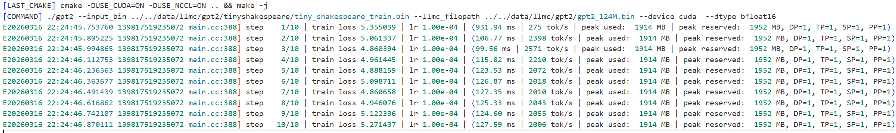
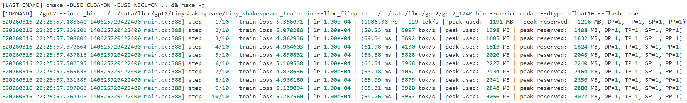
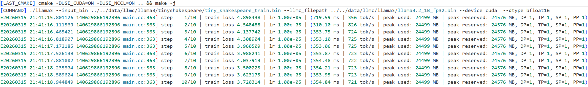
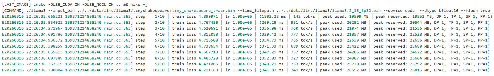

# InfiniTrain 作业报告

## 1. 功能正确性验证
gpt2_1_bfloat16

gpt2_bfloat16_flash

llama3_1_bfloat16

llama3_1_bfloat16_flash

## 2. 性能评估报告
### 2.1 实验环境说明

**硬件环境**
- GPU 型号：NVIDIA A100-SXM4-80GB
- 单卡显存：81920 MiB（80GB）
- 机器总卡数：8 张（index 0~7）
- 本次测试可见设备：`CUDA_VISIBLE_DEVICES=4,5,6,7`
- 实际并行配置：日志中 `DP=1, TP=1, SP=1, PP=1`，即单进程单卡执行

**软件环境**
- CUDA：12.8（`nvcc` build `cuda_12.8.r12.8`）
- Driver：570.133.20
- C++ 编译器：`c++ (Ubuntu 13.3.0) 13.3.0`
- CMake：3.31.4
- 编译命令：`cmake -DUSE_CUDA=ON -DUSE_NCCL=ON .. && make -j`

### 2.2 实验配置

基于四个日志文件：
- `gpt2_1_bfloat16.log`（baseline）
- `gpt2_1_bfloat16_fla.log`（FlashAttention）
- `llama3_1_bfloat16.log`（baseline）
- `llama3_1_bfloat16_fla.log`（FlashAttention）

关键参数（由程序默认参数与命令行确认）：
- `dtype=bfloat16`
- `batch_size=4`
- `sequence_length=64`
- `total_batch_size=256 tokens/step`
- 训练步数：10 steps
- baseline：小算子拼接版本（不加 `--flash true`）
- 实验组：FlashAttention 融合算子版本（`--flash true`）

> 说明：为减少首步冷启动影响，下面主表采用 **step 2~10** 的均值作为稳态指标。

### 2.3 性能指标定义

- 平均时延（avg latency）：每步迭代耗时均值（ms）
- 吞吐率（tokens/s）：日志中的每步 tokens/s 均值
- GPU 显存占用（MB）：日志 `peak used` 的峰值（max）
- 加速比：$\text{Speedup} = \frac{\text{Latency}_{baseline}}{\text{Latency}_{flash}}$
- 显存节省比例：$\text{MemSaving} = \frac{\text{Mem}_{baseline}-\text{Mem}_{flash}}{\text{Mem}_{baseline}} \times 100\%$

### 2.4 结果展示（baseline vs FlashAttention）

| 模型 | 方案 | Avg Latency (ms) | Throughput (tok/s) | Peak Used (MB) |
|---|---|---:|---:|---:|
| GPT2 | baseline | 119.71 | 2153.67 | 1914 |
| GPT2 | FlashAttention | 63.58 | 4057.67 | 3056 |
| LLaMA3 | baseline | 768.33 | 333.78 | 24561 |
| LLaMA3 | FlashAttention | 336.90 | 765.33 | 26552 |

**汇总指标（按模型聚合）**

| 模型 | Speedup (baseline/flash) | 吞吐提升 (flash/baseline) | 显存节省比例 |
|---|---:|---:|---:|
| GPT2 | 1.88x | 1.88x | -59.67% |
| LLaMA3 | 2.28x | 2.29x | -8.11% |

### 2.5 结论分析

1. **GPT2 上 FlashAttention 提升明显**：
	- 时延从 119.71 ms 降到 63.58 ms，Speedup 为 **1.88x**；
	- 吞吐从 2153.67 提升到 4057.67 tok/s（约 **1.88x**）。

2. **LLaMA3 上收益显著**：
	- 时延从 768.33 ms 降到 336.90 ms，Speedup 为 **2.28x**；
	- 吞吐从 333.78 提升到 765.33 tok/s（约 **2.29x**）。

3. **显存占用现象**：
	- GPT2 在本次日志中 FlashAttention 的 `peak used` 更高（1914 MB -> 3056 MB，显存节省比例 -59.67%）；
	- LLaMA3 在本次日志中 FlashAttention 的 `peak used` 也更高（24561 MB -> 26552 MB，显存节省比例 -8.11%）；
	- 说明本次实验里 FlashAttention 的收益主要体现在计算效率（时延/吞吐），而非显存降低。

