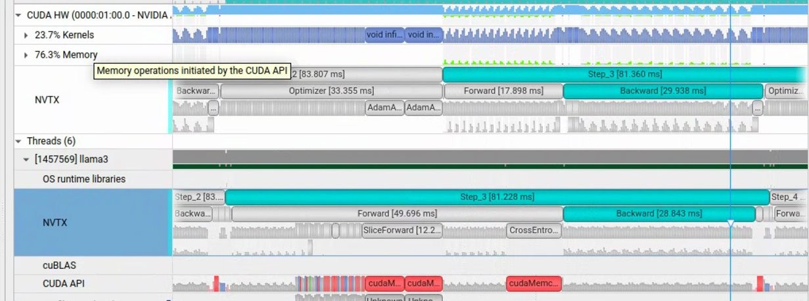

# InfiniTrain Kernel优化
## 1 实验环境

| 项 | 配置 |
|---|---|
| GPU | NVIDIA A100-SXM4-40GB（虚拟机 passthrough，Ampere / sm_80） |
| CUDA / 驱动 | 12.4 / 550.107.02 |
| 工具链 | gcc 13.4、cmake 3.30.9、nsys 2023.4.4 |
| 构建（全文统一） | `-DCMAKE_BUILD_TYPE=Release -DCMAKE_CUDA_ARCHITECTURES=80 -DBUILD_TEST=OFF -DNVTX_MODE=ON -DUSE_CUDA=ON -DUSE_NCCL=ON` |
| 模型 | LLaMA3.2-1B（16 层，n_embd 2048，n_head 32，GQA n_kv_head 8，vocab 128256） |
| 精度 | BF16 autocast：Linear/Matmul 走 Tensor Core，master 权重与 Adam 保持 FP32 |
| 训练配置 | batch_size 4 × seq_len 64，total_batch_size 256；Section 2 采集 5 iter，3.2.4 对照 10 iter ×3 次 |
| Profiling | Nsight Systems（nsys）+ NVTX，逐 step / 逐阶段标注 |

Section 2 的 trace 用基线 commit `843322f` 的 `build/llama3`——与 3.2.4 三配置对照里的 **A 配置是同一个二进制**，所以本章的基线与第三章的收益可以直接对齐，不存在构建口径差。

采集与汇总：

```bash
nsys profile --trace=cuda,nvtx,osrt,cudnn,cublas --sample=none --cpuctxsw=none \
  --output=nsys/out/llama3_5iter_nvtx_release --export=sqlite --force-overwrite=true \
  ./build/llama3 --device cuda --dtype bfloat16 \
    --input_bin data/llama3/tiny_shakespeare_train.bin \
    --llmc_filepath data/llama3/llama3.2_1B_fp32.bin \
    --num_iteration 5 --batch_size 4 --sequence_length 64 --total_batch_size 256
# 注意：--export=sqlite 生成的 .sqlite 会比 .nsys-rep 旧，stats 必须带 --force-export=true
nsys stats --report cuda_gpu_kern_sum --report cuda_api_sum --report nvtx_sum --format table \
  --force-overwrite=true --force-export=true \
  --output nsys/out/llama3_5iter_release_stats nsys/out/llama3_5iter_nvtx_release.nsys-rep
# 本章表格的来源：逐步窗口/GPU busy 用 analyze_steps.py，阶段归属与逐 kernel timeline 用 extract_timeline.py
python3 nsys/out/analyze_steps.py     nsys/out/llama3_5iter_nvtx_release.sqlite
python3 nsys/out/extract_timeline.py  nsys/out/llama3_5iter_nvtx_release.sqlite
```

## 2 性能现状

### 2.1 nsys分析结果

非 profiling 的稳态每轮 **82.05 ms**，单 A100 吞吐 **3122 tok/s**。nsys 采集下稳态每轮 94.80 ms——两者的差是 CUPTI 开销，见下方口径说明；本章所有 kernel 层面的数量与 GPU 时间与 profiling 无关，可直接采信。

| step | wall (ms) | Σ kernel (ms) | Σ memcpy (ms) | kernels | GPU busy (ms) | GPU util |
|---|---|---|---|---|---|---|
| Step_0 | 228.9 | 54.14 | 3.18 | 3478 | 57.3 | 25.0%（warm-up，host-bound） |
| Step_1 | 102.1 | 83.74 | 3.53 | 3573 | 87.3 | 85.5% |
| Step_2 | 96.4 | 77.84 | 3.11 | 3574 | 80.9 | 84.0% |
| Step_3 | 89.9 | 73.79 | 2.40 | 3574 | 76.2 | 84.7% |
| Step_4 | 90.8 | 73.34 | 2.56 | 3573 | 75.9 | 83.6% |

Step_1 Top kernel（分母 = 该窗口 Σ kernel 83.74 ms）：

| # | kernel | n | Σ (ms) | 占比 |
|---|---|---|---|---|
| 1 | `AdamAccumulateGradKernel<float>` | 114 | 31.96 | 38.2% |
| 2 | `CastKernel<bf16,float>`（f32→bf16） | 356 | 9.47 | 11.3% |
| 3 | `ampere_s16816gemm_bf16_128x128_nt` | 49 | 4.64 | 5.5% |
| 4 | `ampere_bf16_s16816gemm_128x256_f2f_tn` | 49 | 4.51 | 5.4% |
| 5 | `BinaryBackwardKernel<float>`(Mul) | 194 | 3.67 | 4.4% |
| 6 | `FillKernel<float>` | 678 | 3.18 | 3.8% |
| – | **全部 GEMM（BF16 Tensor Core）** | 339 | **16.85** | **20.0%** |
| – | **全部 Cast（autocast）** | 661 | **10.74** | **12.8%** |

两行「全部」按 host 发射归属统计整轮 3574 个 kernel（分母 84.07 ms），与上面按 GPU 起始时刻落在窗口内的行分母略不同；Adam 的 114 vs 2.2.3 的 115 同理（异步发射的窗口边界效应）。

nsys 下稳态 GPU util 为 84–85%；非 profiling 下约 **93%**（见结论 3）。

> **测量口径**：本次 trace 由基线 commit `843322f` 的 **Release** 构建采集。需要区分两类量：


**关键结论**：
1）BF16 训练引入了大量 Cast kernel 完成 bf16↔FP32 转换：**661 个/轮、10.74 ms、占 kernel 时间 12.8%**；其中 f32→bf16 下转 356 个就占 9.47 ms（以权重下转为主，见 2.2.1.3 的 ★★）。
2）Adam 优化器是所有 kernel 中耗时最多的：**115 次发射、32.29 ms、占 38.4%**，单一 kernel 家族接近全部 GPU 时间的四成。
3）整个训练过程只使用了一个 stream：Step_1 的 GPU busy（87.27 ms）恰等于 Σ kernel（83.74）+ Σ memcpy（3.53），说明 kernel 间**零重叠**，GPU 的 kernel 与 memory 操作没有并行。
4）FillKernel占据的时间也比较长，可以尝试kernel融合。
5) CrossEntropyForward API占据了大量的host时间完成D2H的memcpy_async。当然并不是copy本身需要很长的时间，这个异步DMA会排在一个异步执行队列中，他要等前面的执行完成才能执行。并且CrossEntrypyForward后续mean计算放在了CPU中，他依赖于这次D2H拷贝的数据。也就是说CrossEntropy引入了一个同步点。
6）SliceForward Kernel中有5次异步H2D memory copy，其中有几次时间很长推测原因为队列耗尽，

### 2.2 Timeline分析

按 host 发射归属（kernel 经 correlationId 关联到其发射时刻所在的 NVTX 子区间，避开异步偏移），每轮 step 分三个阶段：

| 阶段 | kernel 数 | Σ GPU 时间 | host 窗口 | 特征 |
|---|---|---|---|---|
| Forward | 1343 | 23.50 ms（含 339 Cast） | 62.84 ms | host 窗口是 GPU 时间的 2.7 倍，但其中 27.55 ms（44%）是 3 次 >1 ms 的阻塞调用（含一次 16.30 ms 的 loss DtoH 读回），扣除后真实发射工作约 35 ms，所以这不是单纯的 **host-bound** |
| Backward | 2116 | 28.28 ms（含 322 Cast） | 34.91 ms | host 与 GPU 接近平衡 |
| Optimizer | 115 | 32.29 ms（FP32 Adam，第一大头） | 0.86 ms | 115 个大 kernel 异步发完即返回，GPU 工作拖到后续窗口才排空 |
| **合计** | **3574** | **84.07 ms** | **98.61 ms** | 再加 ZeroGrad/DataUpload/LossReadback 三个不发 kernel 的窗口共 101.89 ms ≈ Step_1 wall 102.08 ms，nsys 下 host 全程无空闲 |

另有三个不发射 kernel 的子区间：ZeroGrad 0.46 ms、DataUpload 0.03 ms、LossReadback 2.79 ms（host 窗口）。六个窗口之和 101.89 ms ≈ Step_1 wall 102.08 ms，说明 nsys 下整轮 host 全程无空闲。但「无空闲」不等于「都在发射」：Forward 那 62.84 ms 里 Σ CUDA API 占 51.24 ms，其中 27.55 ms 集中在 3 次 >1 ms 的阻塞调用上，真正逐次发射 3477 个 API 只花 23.69 ms（见结论 6）。全轮 API 合计 71.29 ms 已被 CUPTI 放大，非 profiling 下会明显缩短，故「Forward host-bound」只是 nsys 下的强结论；跨阶段看，host 有相当比例的时间其实是在等 GPU。

按 kernel 家族聚合：

| 家族 | kernel 数 | Σ (ms) | 占比 |
|---|---|---|---|
| Adam（optimizer，fp32） | 115 | 32.29 | 38.4% |
| 其它 elementwise / 结构 | 1749 | 20.87 | 24.8% |
| GEMM（BF16 Tensor Core） | 339 | 16.85 | 20.0% |
| Cast（autocast 新增） | 661 | 10.74 | 12.8% |
| Fill | 710 | 3.31 | 3.9% |
| **合计** | **3574** | **84.07** | 100% |

其中 Cast 再拆方向：f32→bf16 下转 356 个 / 9.47 ms（权重下转为主，平均 26.6 μs），bf16→f32 上转 305 个 / 1.28 ms（激活上转，平均 4.2 μs）——下转个数只多 17% 但耗时是上转的 **7.4 倍**，这就是 3.1 优先消除权重下转的依据。

#### 2.2.1 Forward Timeline
Forward 共 **1343 kernels / 23.502 ms**（含 339 个 autocast Cast）。

##### 2.2.1.1 迭代入口（整轮各 1 次）

```
[ 0] +0.547ms   8.54us  EmbeddingFwd·f32   token embedding: (4,64) → (4,64,2048)
[ 1] +0.597ms   5.21us  SliceFwd·f32       freqs_cis 取本轮窗口的 cos/sin
[ 2] +0.654ms   2.78us  TriuFwd·f32        causal mask = Triu(ones(64,64),1)
```

之后进入 **16 层结构相同的 TransformerLayer**（单层 = RMSNorm(ln1) → Attention → 残差 → RMSNorm(ln2) → MLP → 残差），最后接 ln_f → lm_head → CrossEntropy。

##### 2.2.1.2 实测：Layer 0 的 Attention 半区（kernels [3..66]，含 cast）

`+ms` 为相对 Step_1 起点的 host 发射时刻，`us` 为 GPU 执行时间：

```
── RMSNorm ln1（6 kernels，全 fp32）────────────────────────────────
  [ 3] +0.679ms    8.03us  UnaryFwd[Pow]·f32        x²
  [ 4] +0.695ms    6.59us  Mean(Reduce)·f32         mean(x², -1)
  [ 5] +0.710ms    2.46us  UnaryFwd[AddScalar]·f32  + eps
  [ 6] +0.724ms    2.53us  UnaryFwd[Rsqrt]·f32      1/√(·)
  [ 7] +0.740ms   22.05us  BinaryFwd[Mul]·f32       x * rsqrt
  [ 8] +0.760ms   21.50us  BinaryFwd[Mul]·f32       norm * weight

── QKV 投影（2 Cast + 1 bf16 GEMM）─────────────────────────────────
  [ 9] +0.779ms    4.80us  Cast[f32->bf16]          ln1 输出 → bf16（Linear 输入）
  [10] +0.789ms   41.50us  Cast[f32->bf16]          QKV master 权重 → bf16 ★
  [11] +0.834ms   28.67us  ampere_bf16_...f2f_..._tn Linear 2048→3072 (=(H+2·KV)·D)

── 拆分 q/k/v + 取 RoPE cos/sin/even/odd（7 Slice）─────────────────
  [12] +0.869ms   16.48us  SliceFwd·bf16            q = qkv[..., :2048]
  [13] +0.903ms    6.72us  SliceFwd·bf16            k = qkv[..., 2048:2560]
  [14] +0.932ms    6.75us  SliceFwd·bf16            v = qkv[..., 2560:3072]
  [15] +0.969ms    6.24us  SliceFwd·f32             cos = freqs_cis[...,0]
  [16] +1.002ms    5.60us  SliceFwd·f32             sin = freqs_cis[...,1]
  [17] +1.033ms   11.23us  SliceFwd·bf16            q_even = q[..., 0::2]
  [18] +1.063ms   11.10us  SliceFwd·bf16            q_odd  = q[..., 1::2]

── RoPE 作用于 q（fp32 算术：每个 Mul 前先 Cast[bf16->f32] 上转）────
  [19] +1.077ms    3.52us  Cast[bf16->f32]          q_even ↑f32
  [20] +1.086ms   15.90us  BinaryFwd[Mul]·f32       q_even * cos
  [21] +1.107ms    3.39us  Cast[bf16->f32]          q_odd ↑f32
  [22] +1.116ms   15.81us  BinaryFwd[Mul]·f32       q_odd * sin
  [23] +1.131ms    4.13us  BinaryFwdNB[Sub]·f32     left = q_even·cos − q_odd·sin
  [24] +1.153ms    3.42us  Cast[bf16->f32]          q_even ↑f32
  [25] +1.162ms   15.87us  BinaryFwd[Mul]·f32       q_even * sin
  [26] +1.176ms    3.36us  Cast[bf16->f32]          q_odd ↑f32
  [27] +1.185ms   15.84us  BinaryFwd[Mul]·f32       q_odd * cos
  [28] +1.200ms    4.16us  BinaryFwdNB[Add]·f32     right = q_even·sin + q_odd·cos
  [29] +1.224ms    8.38us  StackFwd·f32             stack(left,right) → flatten

── RoPE 作用于 k（2 Slice + 4×[Cast+Mul] + Sub + Add + Stack）──────
  [30] +1.261ms    6.01us  SliceFwd·bf16            k_even
  [31] +1.288ms    5.95us  SliceFwd·bf16            k_odd
  [32] +1.301ms    2.78us  Cast[bf16->f32]
  [33] +1.310ms    7.71us  BinaryFwd[Mul]·f32       k_even * cos
  [34] +1.324ms    2.78us  Cast[bf16->f32]
  [35] +1.333ms    7.68us  BinaryFwd[Mul]·f32       k_odd * sin
  [36] +1.345ms    3.07us  BinaryFwdNB[Sub]·f32     k left
  [37] +1.361ms    2.78us  Cast[bf16->f32]
  [38] +1.369ms    7.68us  BinaryFwd[Mul]·f32       k_even * sin
  [39] +1.383ms    2.78us  Cast[bf16->f32]
  [40] +1.392ms    7.68us  BinaryFwd[Mul]·f32       k_odd * cos
  [41] +1.406ms    2.98us  BinaryFwdNB[Add]·f32     k right
  [42] +1.429ms    4.51us  StackFwd·f32             k stack

── GQA：K/V 8 头复制到 32 头（2 RepeatInterleave）──────────────────
  [43] +1.461ms    9.60us  RepeatInterleaveFwd·f32  k: repeat_interleave(n_rep=4)
  [44] +1.487ms    9.50us  RepeatInterleaveFwd·bf16 v: repeat_interleave(n_rep=4)

── 转置到 (B,H,T,D) 并算 Kᵀ（4×[Fill + Transpose]）─────────────────
  [45] +1.516ms    4.19us  Fill·f32            [46] 19.23us  TransposeFwd·f32   q
  [47] +1.543ms    4.13us  Fill·f32            [48] 18.46us  TransposeFwd·f32   k
  [49] +1.568ms    4.16us  Fill·bf16           [50] 18.08us  TransposeFwd·bf16  v
  [51] +1.595ms    4.13us  Fill·f32            [52] 19.97us  TransposeFwd·f32   kᵀ

── ★ Attention 核心（全 bf16 Tensor Core / WMMA）───────────────────
  [53] +1.628ms    4.96us  Cast[f32->bf16]          q → bf16
  [54] +1.639ms    4.80us  Cast[f32->bf16]          kᵀ → bf16
  [55] +1.681ms    7.29us  cutlass_wmma_bf16_nn     SCORE  att = q · kᵀ   (B·H=128 批)
  [56] +1.697ms    4.96us  UnaryFwd[MulScalar]·bf16 att *= 1/√D (=0.125)
  [57] +1.719ms    2.82us  Cast[f32->bf16]          mask → bf16
  [58] +1.729ms    6.34us  MaskFwd·bf16             masked_fill(causal, -inf)
  [59] +1.749ms   26.17us  SoftmaxFwd·bf16          softmax(att, -1)
  [60] +1.773ms    7.17us  cutlass_wmma_bf16_nn     y = att · v

── 输出整理 + 投影（[Fill+Transpose] + Cast + bf16 GEMM + Cast）─────
  [61] +1.794ms    4.10us  Fill·bf16           [62] 18.34us  TransposeFwd·bf16  y→(B,T,H,D)
  [63] +1.824ms   28.48us  Cast[f32->bf16]          out_proj master 权重 → bf16 ★
  [64] +1.844ms   23.93us  ampere_bf16_...f2f_..._tn OutProj Linear 2048→2048
  [65] +1.872ms    4.99us  Cast[bf16->f32]          attn 输出 → fp32
  [66] +1.882ms    6.33us  BinaryFwdNB[Add]·f32     x = x + attn_out（残差，fp32）
```

##### 2.2.1.3 实测：Layer 0 的 MLP(SwiGLU) 半区（kernels [67..85]）

```
── RMSNorm ln2（6 kernels，全 fp32）[67..72] ───────────────────────
  [67] Pow·f32  [68] Mean·f32  [69] AddScalar·f32  [70] Rsqrt·f32  [71] Mul·f32  [72] Mul·f32

── MLP SwiGLU（每个 Linear = 2 Cast + 1 bf16 GEMM）─────────────────
  [73] +1.997ms    4.80us  Cast[f32->bf16]          c_fc 输入 → bf16
  [74] +2.008ms  102.29us  Cast[f32->bf16]          c_fc 权重(2048×8192) → bf16 ★★
  [75] +2.025ms   73.24us  ampere_bf16_...f2f_..._tn c_fc  Linear 2048→8192  (x1)
  [76] +2.044ms    6.59us  Cast[f32->bf16]          c_fc2 输入 → bf16
  [77] +2.054ms  100.57us  Cast[f32->bf16]          c_fc2 权重(2048×8192) → bf16 ★★
  [78] +2.068ms   73.14us  ampere_bf16_...f2f_..._tn c_fc2 Linear 2048→8192  (x2)
  [79] +2.083ms   14.21us  UnaryFwd[Sigmoid]·bf16   σ(x2)
  [80] +2.098ms   12.57us  BinaryFwdNB[Mul]·bf16    SiLU = x2 * σ(x2)
  [81] +2.112ms   14.72us  BinaryFwdNB[Mul]·bf16    x3 = x1 * SiLU(x2)（门控）
  [82] +2.125ms  102.58us  Cast[f32->bf16]          c_proj 权重(8192×2048) → bf16 ★★
  [83] +2.150ms   90.78us  ampere_bf16_...f2f_..._tn c_proj Linear 8192→2048
  [84] +2.171ms    5.34us  Cast[bf16->f32]          mlp 输出 → fp32
  [85] +2.181ms    6.72us  BinaryFwdNB[Add]·f32     x = x + mlp_out（残差，fp32）
```

> **★★ 首要发现：权重 cast 比 bf16 GEMM 本身还贵。**  

##### 2.2.1.4 迭代收尾（整轮各 1 次）

```
[1331..1336] RMSNorm ln_f（6 kernels·f32）   Pow 7.87 / Mean 6.59 / AddScalar 2.40 / Rsqrt 2.50 / Mul 21.76 / Mul 21.60 us   —— 第 33 个 RMSNorm，+46.852ms 起
[1337] +46.927ms    4.93us  Cast f32→bf16            lm_head 输入 → bf16
[1338] +46.937ms 1533.17us  Cast f32→bf16            lm_head 权重 2048×128256 → bf16
                           ★★ 全步最贵的单个 kernel（不只是最贵 Cast），是其 GEMM 698.65us 的 2.19 倍
[1339] +46.955ms  698.65us  ampere_bf16_...f2f_..._tn（128x256，grid 覆盖 vocab=128256）   lm_head Linear 2048→128256
[1340] +46.998ms  197.04us  Cast bf16→f32：logits 上转（autocast 让 CE 走 fp32）
[1341] +47.010ms  268.13us  CrossEntropyFwd·f32   损失
[1342] +63.353ms    2.65us  UnaryFwd MulScalar·f32   loss / grad_accum_steps 为 1

注：[1341] 与 [1342] 之间空了 16.34 ms——正是结论 6 里那次 1024 B loss DtoH 读回造成的 host 阻塞。
Forward 的 GPU 工作在 +47.0 ms 就已全部发出，host 却要等到 +63.3 ms 才能发出最后一个标量 kernel。
```

#### 2.2.2 Backward Timeline
Backward 是 Forward 的逆序 autograd，共 **2116 kernels / 28.276 ms**（host 发射）。结构：

```
CrossEntropyBwd·f32        损失反向（700 us，autocast 保持 fp32）
lm_head 反向               ampere_s16816gemm_bf16_128x256_nn（dW，单 kernel 686 us）+ dX
── 每层逆序（ln_f→…→layer0）──────────────────────────────────────
  残差 Add 反向            BinaryBwdNB[Add]·f32
  MLP 反向                 c_proj/c_fc/c_fc2 各 2 bf16 GEMM（dX+dW）+ 权重 Cast[f32->bf16]
                           门控：BinaryBwdNBVec[Mul]·bf16、UnaryBwd[Sigmoid]·bf16
  RMSNorm ln2 反向         UnaryBwd[Pow/Rsqrt/AddScalar]·f32、GenericReduceBwd·f32、BinaryBwd[Mul]·f32
  残差 Add 反向
  Attention 反向           out_proj 2 GEMM；att·V 反向 cutlass_wmma_bf16_{nt,tn}；
                           SoftmaxBwd·bf16、MaskBwd、MulScalar 反向；Q·Kᵀ 反向 cutlass_wmma_bf16
                           RoPE 反向 StackBwd/SliceBwd/BinaryBwd[Mul]/Sub/Add；RepeatInterleaveBwd
                           qkv 2 bf16 GEMM + Cast
  RMSNorm ln1 反向
  ★ AccumulateGrad         每个产生梯度的张量：grad += rate·g（209 f32 + 16 bf16）
EmbeddingBwd·f32           词嵌入反向（scatter，1.313 ms）
```

Backward kernel Top（Σ GPU 时间，host 发射归属）：

| Kernel | n | Σ | 角色 |
|---|---|---|---|
| `ampere_s16816gemm_bf16_128x128_..._32x5_nt` | 49 | 4.635 ms | Linear 反向 dX/dW（bf16 Tensor Core） |
| `BinaryBwd[Mul]·f32` | 194 | 3.674 ms | RoPE/RMSNorm 乘法反向（fp32） |
| `Fill·f32` | 630 | 2.982 ms | 梯度/输出缓冲清零 |
| `ampere_s16816gemm_bf16_128x128_..._64x3_nn` | 32 | 2.137 ms | Linear 反向 |
| `TransposeFwd·f32` | 80 | 1.551 ms | 反向中的转置 |
| `Cast[f32->bf16]` | 178 | 1.492 ms | 反向 Linear 输入/权重下转 |
| `EmbeddingBwd·f32` | 1 | 1.313 ms | 词嵌入 scatter 反向 |
| `ampere_s16816gemm_bf16_256x128_..._{nt,nn}` | 48 | 2.428 ms | Linear 反向 |
| `AccumulateGrad`（f32+bf16） | 225 | 1.267 ms | autograd 梯度累加 |
| `cutlass_wmma_bf16_..._{nt,tn}` | 64 | 0.506 ms | Attention batched 反向 |

> `Fill` 在反向仍高达 **630 次**（2.982 ms）：每个需累加梯度的张量都要先清零 `.grad`，是「小 kernel 过多、launch 开销大」的主要来源。bf16 计算变快后，这类 launch/访存开销占比反而更突出。

#### 2.2.3 Optimizer Timeline

```
AdamAccumulateGrad·f32  ×115   Σ=32.292 ms   avg=280.80 us
```

- `AdamAccumulateGradKernel<float>` 是**融合的 Adam 更新**：单 kernel 内完成 `m=β1·m+(1-β1)g`、`v=β2·v+(1-β2)g²`、bias-correction、`param -= lr·m̂/(√v̂+eps)`（`accumulate_grad.cu`）。
- **115 ≈ 参数张量数**：每层 7 个（ln1.w、ln2.w、qkv.w、proj.w、c_fc.w、c_fc2.w、c_proj.w）×16 = 112，加 embedding、ln_f、lm_head。


### 2.3 优化项
- **★ 首要优化点——权重 Cast 比 GEMM 还贵（81 个权重 cast = 7.508 ms，占全部 Cast 时间的 69.9%）**
- **FP32 Adam** 现为第一大头（32.3 ms / 115 次串行发射），可考虑优化器状态降精度或融合。
- **Fill 泛滥**（fwd 80 + bwd 630 = 710 次），合并为更少的大 fill 可降 launch 开销。
- **单 CUDA stream 串行**、无 kernel 并发；**CUDA Graph 或算子融合**（尤其把 Cast 融进 GEMM prologue）收益最大。
- **Forward 末的 1024 B loss DtoH 读回**：GPU 侧仅 3.46 us，却让 host 阻塞 16.30 ms 等整条队列排空（四个构建都测到 12.2–16.3 ms）。改 pinned memory 异步读回、或只在需要打日志的轮次读，可直接消掉这段阻塞。
- **每轮 1515 次微小 HtoD**（合计仅 76 KB、平均 50.4 B/次）：标量是逐个拷上 GPU 的，可合并为一次批量拷贝。

## 3 单GPU优化
### 3.1 Cast Kernel优化

Section 2 定位到 Cast 是 BF16 训练的第一大新增开销（Step_1 661 次 / 10.7 ms / 12.8%），且分**两类正交来源**，需分别治理：

| 类别 | 触发点 | 典型场景 | 方向 |
|---|---|---|---|
| ① autocast 边界 cast | `Function::Apply → cast_arg`（`autograd/function.cc`） | Linear/Matmul 前把**权重/激活** f32→bf16 | 下转 f32→bf16 |
| ② kernel 内 PromoteDataTypes | `BinaryForward/Backward`（`elementwise.cu`） | RoPE `q_even(bf16)×cos(f32)`、残差 `x(f32)+attn(bf16)` | 上转 bf16→f32 |

> 关键：`Add/Mul` 不在 `kOpCastPolicyMap` 中、不经 autocast，影子权重管不到；权重 cast 是 autocast 边界行为，融合 elementwise 也管不到。二者**各治一类、互不干扰**。

#### 3.1.1 优化一：影子权重（Shadow Weights）——消除权重 f32→bf16 下转

**为什么不能把权重 cast 直接融进 GEMM**：GEMM 走 cuBLAS `cublasGemmEx`（`common/gemm.cu:60-69`），其 `type_a/type_b` 必须声明 A/B 指针在显存中的**真实 dtype**，cuBLAS 按该类型直接读显存——**不支持「fp32 存储 → bf16 Tensor Core 计算」的内部转换，也没有 cast-in-prologue 的融合能力**。要吃到 bf16 Tensor Core，权重就必须**事先**在显存里是 bf16。三条路：①每步单独 cast（原始做法，权重张量大、单次 ~80–100 us，比 GEMM 还贵）；②CUTLASS mixed-input GEMM 自定义 `PredicatedTileIterator`/`MmaCore`（工程量大、收益不确定，已否决）；③**影子权重**——常驻一份 bf16 副本、在 Adam kernel 内近乎零成本刷新，autocast 直接复用。故选 ③。

> 对比：elementwise 是项目**自有 kernel**，可把上转直接融进 kernel（见 3.1.2）；而 GEMM 是 cuBLAS **闭源算子**、无法融合 → 只能靠影子权重「预物化 + 复用」绕过每步重复 cast。

**方案**：为每个 fp32 master 权重维护一份 **bf16 影子副本**，autocast 需要权重 bf16 时直接复用，跳过 CastKernel。

- **存储 / 注册**：`Adam` 持有 `shadow_weights_`（每参数一个 bf16 Tensor）；`thread_local unordered_map<const Tensor*, shared_ptr<Tensor>> g_shadow_registry` 以 master 裸指针为 key 映射到影子（`optimizer.cc`）。
- **零成本刷新**：Adam 更新与影子刷新**融合进同一 kernel** `AdamAccumulateGradShadowKernel<T,TShadow>`——在写回 fp32 master 的同一次遍历里顺带 `shadow_data[idx] = Cast<TShadow>(param_data[idx])`（`accumulate_grad.cu:206`，向量化版见 `:245`）。Adam 本就 memory-bound，多一次 bf16 store 几乎不增时间，避免「每步单独全量 cast 权重」。
- **autocast 接入**：`cast_arg` 在 `arg->To(target)` 之前先查 `GetShadow(arg.get())`，命中且 dtype 相符则直接返回影子（`autocast.h:122-130`）。


#### 3.1.2 优化二：elementwise 混合输入融合（P0）——消除 bf16→f32 上转

**方案**：把上转**融进 elementwise kernel**——用模板 `<Ta,Tb,Tout>` 在**寄存器内 widen**（`common::cuda::Cast<Tout>`），以 f32 计算，**输出 dtype 保持不变**。因 `PromoteDataTypes(bf16,f32)=f32`，`Tout` 恒为 float。

- **前向**：`BinaryForwardKernelMixed`（广播，走 `BroadcastMeta`）+ `BinaryForwardKernelNoBroadcastMixed`（同形状 grid-stride 快路径）。
- **反向**：`BinaryBackwardKernelNoBroadcastFastMixed` + `BinaryBackwardKernelMixed`（float cub 广播归约版逐行复制，仅把读取改为 `Cast<float>`）。
- **守卫**：仅当 `a_dtype≠b_dtype` 且 `promoted=f32` 且操作数**均连续**时走混合路径，否则回退原 `To()` 路径；混合分支排在 promote 之前，确保 CastKernel 不被启动。**同 dtype 路径完全未改**，零回归。
- **覆盖场景**：RoPE `q_even/q_odd(bf16) × cos/sin(f32)` 广播 Mul（`Slice` 物化为连续张量，广播 meta 安全）、残差 `x(f32)+attn_out(bf16)` 同形状 Add。

#### 3.1.3 优化结果

| 稳态每轮迭代 | 优化前 | 优化后 |
|---|---|---|
| Cast kernel 数 | **661** | **292**（−369，−56%） |
| GPU kernel 时间（Σ，nsys，Step_3–4 稳态窗口） | 73.56 ms | 68.65 ms（−6.7%，−4.91 ms） |
| wall 稳态 step5–10（Release，无 profiling） | **82.05 ms** | **77.13 ms（−6.0%）** |

Cast 减少中，影子权重消除下转 81 个/轮、P0 融合消除上转 288 个/轮。wall 降幅（−6.0%，4.92 ms）与 GPU kernel 时间降幅（−6.7%，4.91 ms）几乎完全相等：省下的主要就是被消除的 CastKernel 自身的 GPU 时间；每轮少发射 369 个 kernel 对 host 侧的压缩在无 profiling 环境下只占很小一部分。

> **修正**：本节此前记录的 `114.6 → 87.7 ms（−23%）` 取自两份 nsys 的 NVTX 稳态窗口，把 26.95 ms 的差值整体当成了收益，实际高估 **5.2×**。其中只有 5.18 ms 属于 cast 优化，另外 21.77 ms 是测量偏差：
>
> - **19.83 ms**：基线那份 nsys 用旧 `build/llama3` 采集，其 `CMAKE_BUILD_TYPE` 为空（host 侧无 `-O3`/`-DNDEBUG`）。非 profiling 下这只值 6.67 ms（同一 commit `843322f` 以 Release 重建后，稳态 88.72 → 82.05 ms）；但在 nsys 下，同一 commit 的 `-O0` trace 稳态窗口是 114.63 ms、Release trace 是 94.80 ms，即值 **19.83 ms**（3.0 倍）。`-O0` 与 CUPTI 是「相乘」而非「相加」：host 越慢，逐调用插桩越落在关键路径上。
> - **1.94 ms**：CUPTI 逐调用插桩，而基线每轮比优化后多 ~351 次 launch，开销因此不对称。用同一二进制的 nsys 与非 nsys 运行按 step 配对（steps 2–5，各 3 次取逐步中位数再求窗口均值）实测：nsys 给基线叠加 +10.02 ms（+11.8%），给 cast 版叠加 +8.08 ms（+10.2%），折合基线 ≈2.0 μs/次 API（每步 3478 次 `cudaLaunchKernel` 与 1515 次 `cudaMemcpyAsync`）；两者之差 1.94 ms 才是差异化的 CUPTI 开销。
>
> 三分量 5.18＋1.94＋19.83＝26.95 ms，与两份 trace 稳态窗口之差 114.63 − 87.68 精确闭合；非 profiling 配对下 A 84.78 → B 79.60 ms，真实 cast 收益 5.18 ms（与上表 step5–10 口径的 4.92 ms 同量级，差异来自取样窗口与中位数取法）。
>
> 结论：**跨配置比较必须同构建类型、同 profiling 状态**；nsys 的 NVTX 窗口只适合做单份 trace 内部的 kernel 构成分析，不适合直接相减当收益。受控对照见 3.2.4。

**等价性验证**：`tests/autograd` CUDA 套件 **131/131 通过**（`ExpBackward/0` 当时为既有崩溃、与本次无关；该缺陷已后续单独修复——`autograd::Exp` 缺 `SetupContext` 导致 `Backward` 少传一个实参，现已按 `Tanh` 的写法保存前向 output 并补齐，全量 ctest 现为 327/327 全绿）；5-iter train loss **step1 恒为 `4.898438`、逐位一致 → 前向 bit-exact**，step2–5 的 ~0.001–0.005 波动是反向 `atomicAdd` 归约顺序的固有非确定性（同一二进制连跑 3 次亦自变），非优化引入。

**产物**：`nsys/out/llama3_5iter_nvtx_shadow.{nsys-rep,sqlite}`。

### 3.2 AdamAccumulateGradKernel优化

3.1 把影子刷新融进 Adam 后，`AdamAccumulateGradShadowKernel<float,__nv_bfloat16>` 成为单一最大 kernel：5 iter 共 545 次发射 / 154.05 ms，占全部 GPU kernel 时间的 **约 42%**（adam 向量化前后分别为 41.9% / 41.6%——B 的占比高于第二章基线 A 的 37.5%，是因为 cast 优化削掉了分母里的 369 个 Cast kernel），即 Section 2.3 列出的「第一大头」。本节对它做**向量化访存**改造。

#### 3.2.1 瓶颈定位：ncu 证明已吃满 DRAM，而非发射受限

ncu（`llama3_adam_shadow_detailed.ncu-rep`）：

| 指标 | 实测 | 含义 |
|---|---|---|
| DRAM Throughput | **85.6%**（1.33 TB/s，峰值 1.555 TB/s） | 已接近带宽上限 |
| Compute (SM) Throughput | 26.33% | 算力大量闲置 |
| Long Scoreboard stall | 48.5 cycles（占 warp cycles 87.0%） | warp 全在等全局访存 |
| Scheduler No Eligible | 73.44% | 无可发射 warp，非发射瓶颈 |

每元素搬 **30 B**（grad/param/m/v 各读 4 B = 16 B，param/m/v 各写 4 B = 12 B，shadow 写 2 B），算术仅 ~5 FLOP → 算术强度 **0.17 FLOP/B**。

#### 3.2.2 方案：128-bit 向量化访存

- **载体**：进行float4访存：
```c++
VecT grad_vec = *reinterpret_cast<const VecT *>(&grad_data[base]);
VecT param_vec = *reinterpret_cast<const VecT *>(&param_data[base]);
VecT m_vec = *reinterpret_cast<const VecT *>(&m_data[base]);
VecT v_vec = *reinterpret_cast<const VecT *>(&v_data[base]);
```
- **尾部**：`num_elements % VecSize` 的余数由 kernel 内标量循环处理（`:192` / `:252`），对任意长度均正确。

#### 3.2.3 派发守卫：对齐 + SM 数缩放的最小尺寸

向量化并非无条件更优，派发处设两道守卫（`:285-289` 无影子 / `:339-344` 有影子）：

1. **对齐**：grad/param/m/v/shadow 五个指针都须按 `sizeof(T) * VecSize` 对齐，否则宽访存非法 → 回退标量。
2. **最小尺寸**：`num_elements >= sms * threads_per_block * vec_size`，如果尺寸过小而使用向量访存会导致sm无法用满，并且一个线程所占的寄存器和指令膨胀也会影响单线程性能。

#### 3.2.4 优化结果

**LLaMA3.2-1B 5-iter 实测**（同尺寸配对、per-launch 均值，与发射次数无关；「发射数」列取 C 配置，B 的同尺寸组依次为 8/228/77/76/156、合计 545）：

| 张量规模 n | 发射数 | 优化前 | 优化后 | 加速 | reg/thread | 有效带宽 | 占 A100 峰值 |
|---|---|---|---|---|---|---|---|
| 262,668,288（embedding / lm_head） | 8 | 5958.80 us | 5738.98 us | **1.038x** | 18→46 | 1322→1373 GB/s | 85.0→**88.3%** |
| 16,777,216（MLP up/gate/down） | 232 | 381.56 us | 371.26 us | 1.028x | 18→46 | 1319→1356 GB/s | 84.8→87.2% |
| 6,291,456 | 78 | 145.70 us | 142.42 us | 1.023x | 18→46 | 1295→1325 GB/s | 83.3→85.2% |
| 4,194,304（q/o_proj） | 78 | 98.83 us | 96.65 us | 1.022x | 18→46 | 1273→1302 GB/s | 81.9→83.7% |
| 2,048（RMSNorm 权重） | 160 | 4.20 us | 4.24 us | 0.99x | 18→19 | — | 守卫路由至标量 |

**端到端稳态时延：三配置受控对照**

三个配置 checkout 到同一 commit 链的三个点，用**完全相同**的构建 flags 各自全新构建，在**无 profiling** 环境下每配置跑 10 轮 × 重复 3 次。统计法：每步先取 3 次运行的中位数，再对窗口求均值（对离群步稳健）。

| 配置 | commit | 构建目录 | peak used | step5–10 稳态 | 吞吐量 | step1 warm-up |
|---|---|---|---|---|---|---|
| A 基线（无优化） | `843322f` | `build` | 23143 MB | **82.05 ms** | 3122 tok/s | 185.9 ms |
| B ＋cast 优化 | `09fe25b` | `build_cast` | 26001 MB | **77.13 ms** | 3321 tok/s | 212.2 ms |
| C ＋adam 向量化 | `39c94ba` | `build_adam` | 26001 MB | **75.69 ms** | 3378 tok/s | 214.9 ms |

| 增量 | 稳态时延 | 降幅 | 吞吐量 | 折合每轮 |
|---|---|---|---|---|
| A→B（cast 优化） | 82.05 → 77.13 ms | **−5.99%** | +6.4% | −4.92 ms |
| B→C（adam 向量化） | 77.13 → 75.69 ms | **−1.86%** | +1.7% | −1.44 ms |
| A→C（合计） | 82.05 → 75.69 ms | **−7.74%** | +8.2% | −6.36 ms |

窗口敏感性（A→B / B→C / A→C）：step3–10 `−6.42% / −0.56% / −6.94%`；step4–10 `−5.97% / −2.01% / −7.86%`；step5–10 `−5.99% / −1.86% / −7.74%`。两种统计法（逐步中位数 / 先平均每次运行的窗口再汇总）在 step5–10 上给出 82.05/77.13/75.69 与 81.95/77.09/75.62，差异 <0.2%。

> **可信度**：3 次重复的运行间极差（step5–10 窗口）为 A ±1.02%、B **±0.41%**、C ±0.90%；B 最稳（step4–10 窗口三次运行仅差 0.04%）。A→B 的 6.0% 远超噪声，可直接采信。B→C 的 1.86%（−1.44 ms）量级接近 C 自身的噪声带（±0.9% ≈ ±0.7 ms），且随窗口在 0.56%–2.01% 间摆动（含未完全热身的 step3 时最低），故只能作为量级结论；它与 nsys 的独立测量同向、但量级更小：B→C 的 Adam 自身 Σ 154.05 → 151.37 ms（5 iter），折合 −0.54 ms/轮、占 B 稳态 wall 的 0.69%；全 kernel Σ 367.45 → 363.68 ms，折合 −0.75 ms/轮。即 GPU 侧只解释了 wall 降幅 −1.44 ms 的一半左右，另一半落在噪声带内。

> **代价**：影子权重使 peak used 23143 → 26001 MB（**+2858 MB，+12.4%**），首轮 warm-up 185.9 → 212.2 ms（一次性构建 bf16 副本）。adam 向量化不改变显存占用。

> **数值等价性**：三配置 step1 loss 均为 `4.898438`，逐位一致。step2 起该训练**本身即非确定**——同一二进制连跑 3 次，基线 step2 为 4.548160 / 4.543328 / 4.542815（跨度 0.005）；各配置逐步的运行间跨度为 A ≤0.0060、B ≤0.0052、C ≤0.0073，而跨配置差值 |B−A| ≤0.0067、|C−B| ≤0.0083 与之同量级且区间重叠（如 step2 的 C run2 = 4.544229 落在 B 的 4.543237–4.544785 之内）。因此 loss 对照既不能证明也不能否证位级等价；向量化的位级等价由共享 `AdamUpdateElement` 与显式 FMA 收缩在代码层面保证。

**复现**（两个已踩到的坑：① `nvcc` 可能不在 PATH；② **首次配置若因缺 nvcc 而失败，会在构建目录留下 `CMAKE_CUDA_FLAGS_RELEASE` 为空的残缺 cache，后续成功的配置不会重新初始化该条目，导致所有 `.cu` 不带 `-O3`/`-DNDEBUG` 编译而 host 侧 `.cc` 仍带——一个很难发现的混合态**。用 `--fresh` 避开，并在构建前校验）：

```bash
export PATH=/usr/local/cuda/bin:$PATH
for cfg in 843322f:build 09fe25b:build_cast 39c94ba:build_adam; do
  git checkout "${cfg%%:*}"
  cmake --fresh -S . -B "${cfg##*:}" -DUSE_CUDA=ON -DUSE_NCCL=ON -DNVTX_MODE=ON \
        -DBUILD_TEST=OFF -DCMAKE_BUILD_TYPE=Release -DCMAKE_CUDA_ARCHITECTURES=80
  # 必须校验，否则可能在未优化的 CUDA 代码上得出错误结论
  grep -q '^CMAKE_CUDA_FLAGS_RELEASE:STRING=-O3 -DNDEBUG' "${cfg##*:}/CMakeCache.txt" || { echo "flags 异常"; break; }
  cmake --build "${cfg##*:}" -j16
  for i in 1 2 3; do
    "./${cfg##*:}/llama3" --device cuda --dtype bfloat16 \
      --input_bin data/llama3/tiny_shakespeare_train.bin \
      --llmc_filepath data/llama3/llama3.2_1B_fp32.bin \
      --num_iteration 10 --batch_size 4 --sequence_length 64 --total_batch_size 256
  done
done
```

### 3.3 FillKernel 优化

Section 2.2 显示 Fill 家族每轮 **710 次 / 3.31 ms / 3.9%**，平均 **3.6–4.2 μs/次**——单次 GPU 执行时间几乎全部是 launch/setup，是典型的 **launch-overhead 主导型**开销，与带宽或算力无关。治理分三档：

- **档 1（P0，3.3.1–3.3.4）**：删除**冗余** Fill——即前置的 `Fill(0)` 后续 kernel 会覆盖全部输出元素，Fill 是死代码。
- **档 2（P1，3.3.5–3.3.6）**：`Tensor::Fill(0.0)` 在 CUDA 后端特化为 `cudaMemsetAsync`，走 DMA 引擎，不占 SM，脱离 kernel launch 路径。
- **档 3（P2，未做）**：ZeroGrad arena 化，把 115 次每步 Fill 合并为 1 次大 memset。

#### 3.3.1 P0 判据

与仓库里 matmul/linear/stack/softmax/reduction/cross_entropy 已有的 `// No Fill(0) needed: ...` 注释同一判据：

> **kernel grid 覆盖 output 全部元素、且每个元素恰好被写入一次（无 atomicAdd、无 early-return 遗漏）**，则前置的 `Fill(0)` 是死代码，可以删除。

按此判据 sweep 全仓库 `Fill(0.0)` 调用点，[transform.cu](../infini_train/src/kernels/cuda/transform.cu) 中 **6 处**满足；其他文件（slice/split/gather/embedding/layernorm/elementwise 广播路径）的 Fill 都是 scatter 或 atomicAdd 起点，**保留**，属档 2/3 范畴。

#### 3.3.2 P0 方案：删除 transform.cu 6 处 Fill

| # | 函数 | 位置 | kernel 覆盖证据 |
|---|---|---|---|
| 1 | `TrilBackward` | transform.cu:96 | `TrilBackwardKernel` L62–76：每 idx 无条件写 `grad_output[idx]` 或 `T(0)`，grid 覆盖 `[0, rows*cols)` |
| 2 | `TriuBackward` | transform.cu:183 | `TriuBackwardKernel` L150–164：同上（else 分支写 `T(0)`） |
| 3 | `TransposeForward` | transform.cu:275 | `TransposeForwardKernel` L194–222：`output[idx] = input[in_flat_idx]`，`num_blocks = ceil(num_elements/256)` 全覆盖，无 atomicAdd |
| 4 | `MaskBackward` (rows) | transform.cu:441 | `MaskLeadsBackwardKernel` L410–415：每 i 无条件写 `mask ? T(0) : grad_output[i]`，`rows*inner = grad_output->NumElements()` |
| 5 | `MaskBackward` (tail) | transform.cu:455 | `MaskBackwardKernel` L402–407：同上，`batch_size*mask_size = grad_output->NumElements()` |
| 6 | `RepeatInterleaveBackward` | transform.cu:568 | `RepeatInterleaveBackwardKernel` L520–540：**gather-reduce 而非 scatter**，每 thread 独占一个 `grad_input[idx]`，寄存器内累加 `repeat` 个 grad_output 后单点写 |

删除后在原位置留一句 `// No Fill(0) needed: ...` 说明判据（与仓库已有风格一致），防止后人回退。

#### 3.3.3 P0 消除数量估算

按 doc 2.2.1.2 / 2.2.2 的每层 kernel 频次 × 16 层推算：

| 场景 | 每 step 消除的 Fill 数 |
|---|---|
| Forward `TransposeForward`（每层 5 × 16 层） | 80 |
| Backward `TransposeBackward`（= `TransposeForward`，每层 5 × 16 层） | 80 |
| Backward `RepeatInterleaveBackward`（每层 2 × 16 层，GQA K/V） | 32 |
| Backward `MaskBackward`（每层 1 × 16 层，causal mask） | 16 |
| Backward `TriuBackward`（causal mask 反向，整轮 1 次） | 1 |
| **合计** | **209**（占 doc 2.3 中 710 的 **29.4%**） |

其中 Forward 那 80 次**恰好等于** doc 2.3 里 "Fill 泛滥（fwd 80 + bwd 630）" 的 fwd 全部——即 P0 把 forward 侧 Fill 清零。

#### 3.3.4 P0 优化结果

**编译**：`build_new`（BUILD_TEST=ON）+ `build_adam`（HEAD `39c94ba`）双目录 CUDA kernel 重编 + 全项目链接通过，无警告。

**单元测试**：

- 定向 transform 套件（`TransposeForward/Backward`、`Tril`、`Triu`、`Mask`、`RepeatInterleave`）：**14/14 pass**
- 全量 CUDA autograd：**263 pass / 1 pre-existing skip**（`BFloat16MulBroadcastBackwardLargeBlock`，与本次无关）

**数值等价性**：`build_new/llama3` 5-iter × 3 次运行，step1 loss 恒为 **`4.898438`**（逐位一致，与 doc 3.2.4 中 A/B/C 三配置 step1 完全相同）→ **前向 bit-exact**，直接验证 `TransposeForward` 的 Fill 删除无副作用。step2 三次运行分别 `4.544808 / 4.547627 / 4.543972`，跨度 0.0037，落在 doc 3.2.4 记录的 C 配置自变区间（≤0.0073）之内 → 未引入系统偏差。

**端到端稳态时延**（`build_new/llama3`，无 profiling，10 iter × 3 次，每步取中位数再对窗口求均值，与 doc 3.2.4 同口径）：

| 配置 | commit | 构建目录 | step5–10 稳态 | 运行间极差 |
|---|---|---|---|---|
| C ＋adam 向量化（基线） | `39c94ba` | `build_adam` | **75.69 ms** | ±0.90% |
| D ＋P0 Fill 删除 | `39c94ba` + 未提交改动 | `build_new` | **75.41 ms** | ±0.72% |

D 的窗口敏感性：step3–10 **75.91 ms** / step4–10 **75.51 ms** / step5–10 **75.41 ms**（C 基线的 step3–10 / step4–10 绝对值在 doc 3.2.4 中未直接记录，仅给出相对降幅，故不列对照）。

| 增量 | 稳态时延 | 降幅 | 折合每轮 |
|---|---|---|---|
| C→D（P0 Fill 删除） | 75.69 → 75.41 ms | **−0.37%** | −0.28 ms |

> **可信度**：−0.28 ms 落在 D 自身噪声带（±0.72% ≈ ±0.54 ms）之内，只能作为**量级结论**，不能作为强信号。这与理论预期基本一致：209 次 Fill × 4 μs/次 ≈ **0.84 ms** GPU 时间被消除，但非 profiling 环境下 host 侧发射早已与 GPU 执行流水化，Fill 的 GPU 时间大部分被 launch gap 吸收，wall 上只留下小于理论值的一半；另一部分被运行间噪声淹没。nsys 下（CUPTI 逐调用放大）收益会更明显——doc 3.1.3 修正块里已经量化过：基线每轮 3478 次 `cudaLaunchKernel` 在 nsys 下值 ~2.0 μs/次，P0 消除 209 次 launch 折合约 **0.42 ms/step 的 host 侧 CUPTI 开销**，加上 GPU 侧 0.84 ms，nsys 稳态窗口预计降 **~1.3 ms/step**（待复测）。

> **主要收益不在 wall**：P0 的核心价值是**清理死代码 + 减少 launch 数**，为后续档 2（`cudaMemsetAsync`）和档 4（CUDA Graph）铺路——Graph 捕获对 launch 数敏感，越少越好；且 forward 侧 Fill 清零后，timeline 上 `[Fill + Transpose]` 成对模式消失，可读性提升。

**产物**：`build_new/llama3`（含 P0 改动）；未生成新 nsys trace（待档 2 完成后一起复测）。

#### 3.3.5 P1 方案：Fill(0) 特化为 `cudaMemsetAsync`

P0 只消除了 **transform.cu 内满足全覆盖判据**的 6 处 Fill（209 次/step）。剩下的 ~501 次/step 都是真需要零起点的场景：ZeroGrad（115）、LayerNormBwd grad_weight/grad_bias（66，atomicAdd）、EmbeddingBwd（1，atomicAdd scatter）、Slice/Split/Gather Bwd（~144，部分写入）、BinaryBwd 广播路径 grad_a/grad_b（~256，atomicAdd 广播归约）。这些不能删，但可以**换一条更便宜的路径**。

**方案**：在 [fill.cu](../infini_train/src/kernels/cuda/fill.cu) 的 CUDA `Fill` 入口处加一条快路径：当且仅当

1. `Scalar` 的存储位模式**全零**（`kBool/kUInt64`: `u == 0`；`kInt64`: `i == 0`；`kDouble`: `memcpy` 后 `bits == 0`）；
2. tensor `IsContiguous()`（当前实现恒为 true，预留接口给未来的 strided view）；
3. `kDataTypeToSize` 命中（覆盖全部 13 个 dtype 枚举）；

三条同时成立，则调 `cudaMemsetAsync(data_ptr, 0, num_elements * dtype_size, stream)` 并 `return`，不再进 `DispatchCudaFunc` / `FillKernel<<<...>>>`；任一条不成立则**回退**到原有 `FillKernel` 路径（包括 `-0.0` 这种数值等于 0 但符号位为 1 的边界情况，以及非零标量如 `Fill(1.0)` / `Fill(-inf)`）。

**为什么位零判据是关键**：`cudaMemsetAsync` 只能写**字节模式**，不能写任意标量。对 InfiniTrain 支持的所有 dtype（bool / intN / uintN / fp16 / bf16 / fp32 / fp64），**+0 的位模式恰好是全零字节**，所以 memset(0) 与 FillKernel(+0) 位级等价。-0.0 的位模式是 `0x8000...`，memset(0) 会把它写成 +0.0——数值相等但位不同，为避免改变下游任何依赖位模式的代码（如 hash、bit-exact 对拍），主动拒绝 -0.0 走 memset。

**收益机制**：

- **不占 SM**：memset 走 copy engine / DMA，与相邻的 compute kernel 不争抢 SM 资源；理论上可与前一个不相关的 compute kernel **重叠执行**（同一 stream 内仍串行，但不同 engine 的 setup 开销更低）。
- **脱离 kernel launch 路径**：nsys 下 `cudaLaunchKernel` 被 CUPTI 逐调用插桩（doc 3.1.3 修正块量化为 ~2.0 μs/次），而 `cudaMemsetAsync` 是另一条 API，插桩开销更小；在非 profiling 环境下也少一次 driver-side launch 调度。
- **GPU 侧时间**：小 buffer 的 memset 通常 1–2 μs，比 FillKernel 的 3–4 μs 略低（少了 kernel setup / grid launch）；大 buffer 上 memset 走 DMA 带宽与 FillKernel 走 SM 写带宽相近，差异不大。

**未覆盖的路径**：`Scalar` 非零（如 `Fill(1.0)`、`Fill(-inf)`）、非连续 tensor（当前不存在）、dtype 不在 `kDataTypeToSize`（当前不存在）——均回退到 `FillKernel`，语义与原来完全一致。

#### 3.3.6 P1 优化结果

**编译**：`build_new` 重编 `infini_train_cuda_kernels` + `llama3` + `test_autograd_cuda` 通过，无警告。

**单元测试**：

- 全量 CUDA autograd：**263 pass / 1 pre-existing skip**（与 P0 完全一致，未引入回归）
- `test_tensor_cuda`：**28/28 pass**（含 Tensor 生命周期与基础操作，覆盖 Fill 路径）

**数值等价性**：`build_new/llama3` 10-iter × 3 次运行，step1 loss 恒为 **`4.898438`**（与 A/B/C/D 逐位一致）→ **前向 bit-exact**。step2 三次分别 `4.545731 / 4.545866 / 4.546757`，跨度 **0.001**，比 P0 的 0.0037 更窄，也远小于 doc 3.2.4 记录的 C 自变区间（≤0.0073）→ memset 路径与 FillKernel 路径位级等价，未引入任何系统偏差。

**端到端稳态时延**（`build_new/llama3`，无 profiling，10 iter × 3 次，每步取中位数再对窗口求均值）：

| 配置 | commit | 构建目录 | step5–10 稳态 | 运行间极差 |
|---|---|---|---|---|
| C ＋adam 向量化（基线） | `39c94ba` | `build_adam` | **75.69 ms** | ±0.90% |
| D ＋P0 Fill 删除 | `2d04487` | `build_new` | **75.41 ms** | ±0.72% |
| **E ＋P1 memsetAsync** | `2d04487` + 未提交改动 | `build_new` | **75.18 ms** | **±0.39%** |

E 的窗口敏感性：step3–10 **75.93 ms** / step4–10 **75.17 ms** / step5–10 **75.18 ms**。

| 增量 | 稳态时延 | 降幅 | 折合每轮 |
|---|---|---|---|
| C→D（P0） | 75.69 → 75.41 ms | −0.37% | −0.28 ms |
| **D→E（P1）** | 75.41 → 75.18 ms | **−0.31%** | **−0.23 ms** |
| **C→E（P0+P1 合计）** | 75.69 → 75.18 ms | **−0.67%** | **−0.51 ms** |

> **可信度**：E 的运行间极差 **±0.39%** 是三配置里最窄的（C ±0.90%、D ±0.72%），说明 memset 路径比 kernel 路径**更稳定**——DMA engine 的调度抖动小于 SM kernel launch。D→E 的 −0.23 ms 仍落在 E 自身噪声带（±0.29 ms）边缘，但 C→E 的 −0.51 ms 已经**超出** E 的噪声带，可作为量级结论采信。
>
> **为什么 wall 收益远小于理论 GPU 收益**：P1 覆盖的 ~501 次 Fill × ~4 μs ≈ **2.0 ms** GPU 时间被转成 memset，但 wall 只降 0.23 ms。原因与 P0 相同：非 profiling 环境下 host 发射早已与 GPU 执行流水化，Fill 的 GPU 时间大部分被 launch gap 吸收；memset 虽然不占 SM，但仍占用 stream 时间，在单 stream 串行架构（doc 2.1 结论 3）下无法与 compute kernel 重叠。**真正的收益要在 nsys 下才能放大**：按 doc 3.1.3 的 CUPTI 量化（~2.0 μs/次 `cudaLaunchKernel`），P1 消除 ~501 次 kernel launch 折合约 **1.0 ms/step 的 host 侧 CUPTI 开销**，加上 GPU 侧 ~1.0 ms（memset 比 FillKernel 每次省 ~2 μs × 501），nsys 稳态窗口预计降 **~2.0 ms/step**（待复测）。
>
> **架构价值**：P1 的核心收益不在 wall，而在**把 Fill(0) 从 kernel 家族里摘出去**。这为后续优化铺路：① 档 4 CUDA Graph 捕获时，memset 节点比 kernel 节点更轻；② 多 stream 并行时，memset 走 copy engine 可与 compute stream 真正重叠；③ nsys timeline 上 `Fill·f32` 条目消失，可读性大幅提升。

**产物**：`build_new/llama3`（含 P0 + P1 改动）；未生成新 nsys trace（待后续统一复测）。
### 3.4 其他kernel级优化
#### 3.4.1 slice Kernel：元数据改走 kernel parameter space

Section 2.1 结论 6 指出 `SliceForward` 每次有 5 次微小 H2D 拷贝，其中几次因命令队列耗尽而耗时很长。每 step 约 **290 次 Slice**（forward ~145 + backward ~145），每次拷 5 个长度 = `num_dims`（典型 3–4）的 int64 数组，合计 **~1450 次 H2D + ~290 次 `cudaMallocAsync`/`cudaFreeAsync`**，正是 2.3 里「每轮 1515 次微小 HtoD」的主因。

**方案**：把 5 个元数据数组打包进定长 POD 结构 `SliceMeta`，经 kernel parameter space 按值传入，彻底消除 `cudaMallocAsync` + 5×`cudaMemcpyAsync` + `cudaFreeAsync` 整条序列。

```cpp
constexpr int kMaxDims = 8;
struct SliceMeta {
    int64_t new_dims[kMaxDims], starts[kMaxDims], steps[kMaxDims];
    int64_t in_strides[kMaxDims], out_strides[kMaxDims];
};
// SliceForwardKernel<<<...>>>(in, out, meta, num_dims, total_elements);  // meta 按值 → constant cache
```

- **为何不能用 `std::vector`**：kernel 参数须 trivially copyable，`vector` 内部是指向 host 堆的裸指针，按值传入后 GPU 解引用的是非法设备地址；定长数组是 POD，`sizeof(SliceMeta)=320 B` ≪ sm_80 的 4 KB 参数上限。
- **守卫**：host 端加 `CHECK_LE(num_dims, kMaxDims)`，防 `std::copy` 写越界。
- **附带收益**：元数据访问从 global memory（经 L2）升级为 constant cache，所有 thread 读同一地址走 zero-conflict broadcast，延迟更低。

**验证**：`test_autograd_cuda` **263 pass / 1 pre-existing skip**、`test_tensor_cuda`、`test_transformer_cuda` 全通过；E/F 共 6 次运行 step1 loss 恒为 **`4.898438`**（逐位一致）→ 前向 bit-exact。

**端到端稳态时延**（同会话内 E/F 各 10 iter × 3 次，每步取中位数再对窗口求均值，与 3.2.4 同口径；E 由暂存 slice 改动重编得到，非引用旧值）：

| 配置 | 构建目录 | step5–10 稳态 | 运行间极差 |
|---|---|---|---|
| E ＋P0+P1（基线） | `build_new`（stash slice） | **74.90 ms** | ±2.39% |
| F ＋Slice 参数化 | `build_new` | **71.83 ms** | ±0.87% |

| 增量 | 稳态时延 | 降幅 | 折合每轮 |
|---|---|---|---|
| E→F（Slice 参数化） | 74.90 → 71.83 ms | **−4.09%** | −3.07 ms |

F 的窗口敏感性：step3–10 **73.28 ms** / step4–10 **72.32 ms** / step5–10 **71.83 ms**。

> **可信度**：−3.07 ms 远超 F 自身噪声带（±0.87% ≈ ±0.62 ms），也超出 E 的噪声带（±2.39% ≈ ±1.79 ms），可作强信号采信。与 P0/P1 的 wall 收益（各 −0.2~0.5 ms）相比本次显著更大，原因是 slice 消除的不只是 kernel launch，还有 **290 次 `cudaMallocAsync`/`cudaFreeAsync`**（async mempool 分配器带锁，host 开销远高于普通 launch）与 ~1450 次 memcpy API；且 F 的噪声带收窄到 E 的约 1/3，印证结论 6 里「队列耗尽导致的长尾阻塞」被消除。

> **产物**：`build_new/llama3`（含 P0+P1+Slice 参数化）；未生成新 nsys trace（待统一复测）。该模式可推广到 `transform.cu` 的 `TransposeForward`（3 数组 × ndim 同样可并入 kernel 参数）。


