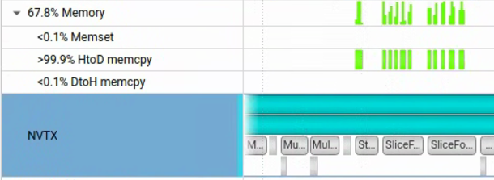
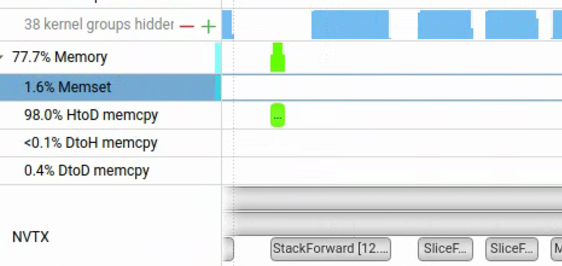
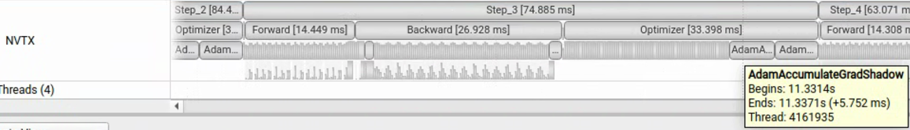
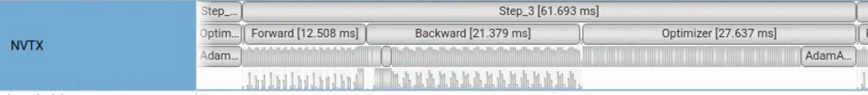

# InfiniTrain Kernel优化
> 摘要：在单卡A100(40G)上，对llama3.2-1B模型训练进行kernel优化。基线版本每轮迭代82.05ms(3122 tok/s)：Adam优化器，cast、Fill等kernel占据了时延大头。进行1）影子权重+cast融合，2）adam向量化，3）Fill-> memsetasync，4）slice H2D->传参，5）RMSNorm融合，6）Embedding稀疏化。经过6轮优化后，稳态wall时间来到59.27ms(4319 tok/s)，吞吐提升**38%**。

[TOC]

## 1 实验环境

| 项 | 配置 |
|---|---|
| GPU | NVIDIA A100-SXM4-40GB（虚拟机 passthrough，Ampere / sm_80） |
| CUDA / 驱动 | 12.4 / 550.107.02 |
| 工具链 | gcc 13.4、cmake 3.30.9、nsys 2023.4.4 |
| 构建（全文统一） | `-DCMAKE_BUILD_TYPE=Release -DCMAKE_CUDA_ARCHITECTURES=80 -DBUILD_TEST=OFF -DNVTX_MODE=ON -DUSE_CUDA=ON -DUSE_NCCL=ON` |
| 模型 | LLaMA3.2-1B（16 层，n_embd 2048，n_head 32，GQA n_kv_head 8，vocab 128256） |
| 精度 | BF16 autocast：Linear/Matmul 走 Tensor Core，master 权重与 Adam 保持 FP32 |
| 训练配置 | batch_size 4 × seq_len 64，total_batch_size 256 |
| Profiling | Nsight Systems（nsys）+ NVTX，逐 step / 逐阶段标注 |

采集与汇总：

```bash
nsys profile --trace=cuda,nvtx,osrt,cudnn,cublas --sample=none --cpuctxsw=none \
  --output=nsys/out/llama3_5iter_nvtx_release --export=sqlite --force-overwrite=true \
  ./build/llama3 --device cuda --dtype bfloat16 \
    --input_bin data/llama3/tiny_shakespeare_train.bin \
    --llmc_filepath data/llama3/llama3.2_1B_fp32.bin \
    --num_iteration 5 --batch_size 4 --sequence_length 64 --total_batch_size 256
# 注意：--export=sqlite 生成的 .sqlite 会比 .nsys-rep 旧，stats 必须带 --force-export=true
nsys stats --report cuda_gpu_kern_sum --report cuda_api_sum --report nvtx_sum --format table \
  --force-overwrite=true --force-export=true \
  --output nsys/out/llama3_5iter_release_stats nsys/out/llama3_5iter_nvtx_release.nsys-rep
# 本章表格的来源：逐步窗口/GPU busy 用 analyze_steps.py，阶段归属与逐 kernel timeline 用 extract_timeline.py
python3 nsys/out/analyze_steps.py     nsys/out/llama3_5iter_nvtx_release.sqlite
python3 nsys/out/extract_timeline.py  nsys/out/llama3_5iter_nvtx_release.sqlite
```

## 2 性能现状

### 2.1 nsys分析结果

非 profiling 的稳态每轮 **82.05 ms**，单 A100 吞吐 **3122 tok/s**。nsys 采集下稳态每轮 94.80 ms——两者的差是 CUPTI 开销，见下方口径说明；

| step | wall (ms) | Σ kernel (ms) | Σ memcpy (ms) | kernels | GPU busy (ms) | GPU util |
|---|---|---|---|---|---|---|
| Step_0 | 228.9 | 54.14 | 3.18 | 3478 | 57.3 | 25.0%（warm-up，host-bound） |
| Step_1 | 102.1 | 83.74 | 3.53 | 3573 | 87.3 | 85.5% |
| Step_2 | 96.4 | 77.84 | 3.11 | 3574 | 80.9 | 84.0% |
| Step_3 | 89.9 | 73.79 | 2.40 | 3574 | 76.2 | 84.7% |
| Step_4 | 90.8 | 73.34 | 2.56 | 3573 | 75.9 | 83.6% |

Step_1 Top kernel（分母 = 该窗口 Σ kernel 83.74 ms）：

| # | kernel | n | Σ (ms) | 占比 |
|---|---|---|---|---|
| 1 | `AdamAccumulateGradKernel<float>` | 114 | 31.96 | 38.2% |
| 2 | `CastKernel<bf16,float>`（f32→bf16） | 356 | 9.47 | 11.3% |
| 3 | `ampere_s16816gemm_bf16_128x128_nt` | 49 | 4.64 | 5.5% |
| 4 | `ampere_bf16_s16816gemm_128x256_f2f_tn` | 49 | 4.51 | 5.4% |
| 5 | `BinaryBackwardKernel<float>`(Mul) | 194 | 3.67 | 4.4% |
| 6 | `FillKernel<float>` | 678 | 3.18 | 3.8% |
| – | **全部 GEMM（BF16 Tensor Core）** | 339 | **16.85** | **20.0%** |
| – | **全部 Cast（autocast）** | 661 | **10.74** | **12.8%** |


nsys 下稳态 GPU util 为 84–85%；非 profiling 下约 **93%**。

> **测量口径**：本次 trace 由基线 commit `34a52a8` 的 **Release** 构建采集。需要区分两类量：**nsys 采集值**含 CUPTI 逐调用插桩开销（同一二进制按 step 配对实测：nsys 给基线叠加 +10.02 ms，按每步 3478 次 `cudaLaunchKernel` + 1515 次 `cudaMemcpyAsync` 折算 ≈ **2.0 μs/次 API**）；**非 profiling 运行值**才是真实性能（稳态 **82.05 ms** / 3122 tok/s）。全章收益一律以非 profiling wall 结算，两种口径不可直接相减。


**关键结论**：

1）BF16 训练引入了大量 Cast kernel 完成 bf16↔FP32 转换：**661 个/轮、10.74 ms、占 kernel 时间 12.8%**；其中 f32→bf16 下转 356 个就占 9.47 ms（以权重下转为主）。

2）Adam 优化器是所有 kernel 中耗时最多的：**114 次发射、31.96 ms、占 38.2%**，单一 kernel 家族接近全部 GPU 时间的四成；其中 lm_head 和 embedding 的参数更新，单个 kernel 就占了 5 ms 左右的时间。

3）整个训练过程只使用了一个 stream。

4）FillKernel占据的时间也比较长，可以尝试用异步memset替换。

5）CrossEntropyForward API占据了大量的host时间完成D2H的memcpy_async。当然并不是copy本身需要很长的时间，这个异步DMA会排在一个异步执行队列中，他要等前面的执行完成才能执行。并且CrossEntrypyForward后续mean计算放在了CPU中，他依赖于这次D2H拷贝的数据。也就是说CrossEntropy引入了一个同步点。

6）SliceForward Kernel中有5次异步H2D memory copy，其中有几次时间很长推测原因为队列耗尽，

### 2.2 Timeline分析

参考timeline.md


### 2.3 优化项
- **cast kernel泛滥**
- **FP32 Adam 降低内存带宽要求**
- **Fill 泛滥**
- **单 CUDA stream 串行**
- **Forward 末的 1024 B loss DtoH 读回**：GPU 侧仅 3.46 us，却让 host 阻塞 16.30 ms 等整条队列排空（四个构建都测到 12.2–16.3 ms）。改 pinned memory 异步读回、或只在需要打日志的轮次读，可直接消掉这段阻塞。
- **每轮 1515 次微小 HtoD**（合计仅 76 KB、平均 50.4 B/次）：标量是逐个拷上 GPU 的，可合并为一次批量拷贝。

## 3 单GPU优化
### 3.1 Cast Kernel优化

Section 2 定位到 Cast 是 BF16 训练的第二大开销（Step_1 661 次 / 10.7 ms / 12.8%），且分**两类正交来源**，需分别治理：

#### 3.1.1 优化一：影子权重（Shadow Weights）——消除gemm前的cast kernel

有两个方案：1）将cast kernel和后续的gemm kernel进行融合；2）备份一份bf16格式的权重，在forward阶段和backward阶段直接用备份权重。

考虑cuBLAS不支持进行定制融合，并且手写gemm很难达到cuBLAS的性能，所以采用方案2。

**方案**：为每个 fp32 master 权重维护一份 **bf16 影子副本**，autocast 需要权重 bf16 时直接复用，跳过 CastKernel。

- **存储 / 注册**：`Adam` 持有 `shadow_weights_`（每参数一个 bf16 Tensor）；`thread_local unordered_map<const Tensor*, shared_ptr<Tensor>> g_shadow_registry` 以 master 裸指针为 key 映射到影子（`optimizer.cc`）。
- **零成本刷新**：Adam 更新与影子刷新**融合进同一 kernel** `AdamAccumulateGradShadowKernel<T,TShadow>`——写回 fp32 权重的同时，在adam kernel内写回bf16影子权重。
- **autocast 接入**：`cast_arg` 在 `arg->To(target)` 之前先查 `GetShadow(arg.get())`，命中且 dtype 相符则直接返回影子（`autocast.h:122-130`）。


#### 3.1.2 优化二：elementwise 混合输入融合

**方案**：把cast操作**融进 elementwise kernel**——用模板 `<Ta,Tb,Tout>` 在**寄存器内 widen**（`common::cuda::Cast<Tout>`），以 f32 计算，**输出 dtype 保持不变**。


#### 3.1.3 优化结果

| 配置 | commit | peak used | step5–10 稳态 | 吞吐量 | 性能提升 |
|---|---|---|---|---|---|
| A 基线（无优化） | `34a52a8` | 23143 MB | **82.05 ms** | 3122 tok/s | 0% |
| B ＋cast 优化 | `fe5591a` | 26001 MB | **77.13 ms** | 3321 tok/s | +6.4% |

专项指标（A→B）：Cast kernel 数 661 → **292**（−369，−56%）；nsys 下 GPU kernel Σ（Step_3–4 稳态窗口）73.56 → 68.65 ms（−6.7%，−4.91 ms）。


### 3.2 AdamAccumulateGradKernel优化——向量化访存

`AdamAccumulateGradShadowKernel<float,__nv_bfloat16>` 在稳态迭代中占据了最长时间：5 iter 共 545 次发射 / 154.05 ms，占全部 GPU kernel 时间的 **约 42%**。分析显存带宽是 Adam kernel 的性能瓶颈，尝试对它做**向量化访存**改造。

#### 3.2.1 瓶颈定位：ncu 证明已吃满 DRAM，而非发射受限

ncu（`llama3_adam_shadow_detailed.ncu-rep`）：

| 指标 | 实测 | 含义 |
|---|---|---|
| DRAM Throughput | **85.6%**（1.33 TB/s，峰值 1.555 TB/s） | 已接近带宽上限 |
| Compute (SM) Throughput | 26.33% | 算力大量闲置 |
| Long Scoreboard stall | 48.5 cycles（占 warp cycles 87.0%） | warp 全在等全局访存 |
| Scheduler No Eligible | 73.44% | 无可发射 warp，非发射瓶颈 |

每元素搬 **30 B**（grad/param/m/v 各读 4 B = 16 B，param/m/v 各写 4 B = 12 B，shadow 写 2 B），算术仅 ~5 FLOP → 算术强度 **0.17 FLOP/B**。

#### 3.2.2 方案：128-bit 向量化访存

- **载体**：进行float4访存：
```c++
VecT grad_vec = *reinterpret_cast<const VecT *>(&grad_data[base]);
VecT param_vec = *reinterpret_cast<const VecT *>(&param_data[base]);
VecT m_vec = *reinterpret_cast<const VecT *>(&m_data[base]);
VecT v_vec = *reinterpret_cast<const VecT *>(&v_data[base]);
```
- **尾部**：`num_elements % VecSize` 的余数由 kernel 内标量循环处理（`:192` / `:252`），对任意长度均正确。

#### 3.2.3 派发守卫：对齐 + SM 数缩放的最小尺寸

向量化并非无条件更优，派发处设两道守卫（`:285-289` 无影子 / `:339-344` 有影子）：

1. **对齐**：grad/param/m/v/shadow 五个指针都须按 `sizeof(T) * VecSize` 对齐，否则宽访存非法 → 回退标量。
2. **最小尺寸**：`num_elements >= sms * threads_per_block * vec_size`，如果尺寸过小而使用向量访存会导致sm无法用满，并且一个线程所占的寄存器和指令膨胀也会影响单线程性能。

#### 3.2.4 优化结果

**LLaMA3.2-1B 5-iter 实测** kernel优化结果：

| 张量规模 n | 发射数 | 优化前 | 优化后 | 加速 | reg/thread | 有效带宽 | 占 A100 峰值 |
|---|---|---|---|---|---|---|---|
| 262,668,288（embedding / lm_head） | 8 | 5958.80 us | 5738.98 us | **1.038x** | 18→46 | 1322→1373 GB/s | 85.0→**88.3%** |
| 16,777,216（MLP up/gate/down） | 232 | 381.56 us | 371.26 us | 1.028x | 18→46 | 1319→1356 GB/s | 84.8→87.2% |
| 6,291,456 | 78 | 145.70 us | 142.42 us | 1.023x | 18→46 | 1295→1325 GB/s | 83.3→85.2% |
| 4,194,304（q/o_proj） | 78 | 98.83 us | 96.65 us | 1.022x | 18→46 | 1273→1302 GB/s | 81.9→83.7% |
| 2,048（RMSNorm 权重） | 160 | 4.20 us | 4.24 us | 0.99x | 18→19 | — | 守卫路由至标量 |

**端到端稳态时延：三配置受控对照**

三个配置 checkout 到同一 commit 链的三个点，用**完全相同**的构建 flags 各自全新构建，在**无 profiling** 环境下每配置跑 10 轮 × 重复 3 次。统计法：每步先取 3 次运行的中位数，再对窗口求均值（对离群步稳健）。

| 配置 | commit | peak used | step5–10 稳态 | 吞吐量 | 性能提升 |
|---|---|---|---|---|---|
| A 基线（无优化） | `34a52a8` | 23143 MB | **82.05 ms** | 3122 tok/s | 0% |
| B ＋cast 优化 | `fe5591a` | 26001 MB | **77.13 ms** | 3321 tok/s | +6.4% |
| C ＋adam 向量化 | `c07805a` | 26001 MB | **75.69 ms** | 3378 tok/s | +8.2% |

优化结果并不理想，原因是显存带宽已经接近理论上限，即使使用向量化访存，也无法提升太多性能。

### 3.3 FillKernel 优化

Section 2.1 显示 Fill 家族每轮 **710 次 / 3.31 ms / 4.0%**（`FillKernel<float>` 678 次 / 3.18 ms + bf16 版 32 次 / 0.13 ms，Step_1 窗口），单次均值 **3.6–4.7 μs**——单次 GPU 执行时间几乎全部是 launch/setup，是典型的 **launch-overhead 主导型**开销，与带宽或算力无关。分两步优化：

- **第一步：删除冗余 Fill**——即前置的 `Fill(0)` 后续 kernel 会覆盖全部输出元素，Fill 是死代码。
- **第二步**：`Tensor::Fill(0.0)` 在 CUDA 后端特化为 `cudaMemsetAsync`，走 DMA 引擎，不占 SM，脱离 kernel launch 路径。

#### 3.3.1 删除 transform.cu 6 处 Fill

| # | 函数 | 位置 | kernel 覆盖证据 |
|---|---|---|---|
| 1 | `TrilBackward` | transform.cu:96 | `TrilBackwardKernel` L62–76：每 idx 无条件写 `grad_output[idx]` 或 `T(0)`，grid 覆盖 `[0, rows*cols)` |
| 2 | `TriuBackward` | transform.cu:183 | `TriuBackwardKernel` L150–164：同上（else 分支写 `T(0)`） |
| 3 | `TransposeForward` | transform.cu:275 | `TransposeForwardKernel` L194–222：`output[idx] = input[in_flat_idx]`，`num_blocks = ceil(num_elements/256)` 全覆盖，无 atomicAdd |
| 4 | `MaskBackward` (rows) | transform.cu:441 | `MaskLeadsBackwardKernel` L410–415：每 i 无条件写 `mask ? T(0) : grad_output[i]`，`rows*inner = grad_output->NumElements()` |
| 5 | `MaskBackward` (tail) | transform.cu:455 | `MaskBackwardKernel` L402–407：同上，`batch_size*mask_size = grad_output->NumElements()` |
| 6 | `RepeatInterleaveBackward` | transform.cu:568 | `RepeatInterleaveBackwardKernel` L520–540：**gather-reduce 而非 scatter**，每 thread 独占一个 `grad_input[idx]`，寄存器内累加 `repeat` 个 grad_output 后单点写 |

#### 3.3.2 Fill 特化为 `cudaMemsetAsync`

`BinaryBwd[Mul]` 的 grad_a/grad_b 广播归约、`EmbeddingBwd`（1，atomicAdd scatter）等场景不能删除fill kernel，但可以将kernel更新为`cudaMemsetAsync`。

#### 3.3.3 优化结果


**端到端稳态时延**（`build_new/llama3`，无 profiling，10 iter × 3 次，每步取中位数再对窗口求均值）：

| 配置 | commit | peak used | step5–10 稳态 | 吞吐量 | 性能提升 |
|---|---|---|---|---|---|
| C ＋adam 向量化（基线） | `c07805a` | 26001 MB | **75.69 ms** | 3378 tok/s | 0% |
| D ＋P0 Fill 删除 | `3bbdd76` | — | **75.41 ms** | 3395 tok/s | +0.4% |
| **E ＋P1 memsetAsync** | `9c1947ff` | — | **74.90 ms** | 3418 tok/s | **+1.0%** |

> **为什么 wall 收益远小于理论 GPU 收益**：单stream，并没有真正并行起来。优化结果不能排除是随机导致的。

### 3.4 slice Kernel

`SliceForward` 每次有 5 次微小 H2D 拷贝，其中几次因命令队列耗尽而耗时很长。每 step **257 次 Slice**，每次拷 5 个长度 = `num_dims`（典型 3–4）的 int64 数组，合计 **1285 次 H2D + 257 对 `cudaMallocAsync`/`cudaFreeAsync`**。



#### 3.4.1 H2D -> 参数传递

**方案**：把 5 个元数据数组打包进定长 POD 结构 `SliceMeta`，经 kernel parameter space 按值传入，彻底消除 `cudaMallocAsync` + 5×`cudaMemcpyAsync` + `cudaFreeAsync` 整条序列。

```cpp
constexpr int kMaxDims = 8;
struct SliceMeta {
    int64_t new_dims[kMaxDims], starts[kMaxDims], steps[kMaxDims];
    int64_t in_strides[kMaxDims], out_strides[kMaxDims];
};
// SliceForwardKernel<<<...>>>(in, out, meta, num_dims, total_elements);  // meta 按值 → constant cache
```

#### 3.4.3 优化结果

| 配置 | commit | peak used | step5–10 稳态 | 吞吐量 | 性能提升 |
|---|---|---|---|---|---|
| E ＋P0+P1（基线） | `9c1947ff` | — | **74.90 ms** | 3418 tok/s | 0% |
| F ＋Slice 参数化 | `c2b2de39` | — | **71.83 ms** | 3564 tok/s | **+4.3%** |

消除了Slice kernel前全部的5次memcpy。



### 3.5 RMSNorm Kernel 融合

根据timeline 分析，一轮forward迭代会出现33次 RMSNorm调用（16 层 × 2 个 RMSNorm + 收尾 ln_f）。每次由 Pow → Mean → AddScalar → Rsqrt → Mul → Mul **六个独立 kernel** 组成，forward 侧合计 **198 个 kernel/step**。本节把整个 RMSNorm 融合为单 Function：forward、backward 各一个 kernel，减少重复的显存读写和kernel launch开销。

#### 3.5.1 方案：autograd::RMSNorm + 融合 kernel（参考 LayerNorm）

- **Function 层**：新增 `autograd::RMSNorm`。Forward 经 `Dispatcher` 调 `RMSNormForward`，一次返回 `{output, rstd}`；`rstd` 标记不可微，连同 `input/weight` 存入反向上下文。Backward 调 `RMSNormBackward` 返回 `{grad_input, grad_weight}`。
- **数学**：forward 分两步计算（`n = x·rstd` → `y = n·w`，不合并为 `x·(rstd·w)`），保持与 composite 相同的舍入行为；backward 用 `S1 = Σ g·w·x`、`K = (S1/H)·rstd`、`dx = rstd·(g·w − n·K)`、`dw = Σ g·n`（跨 token 块 `atomicAdd`）。
- **grad_weight 清零**：权重梯度跨 token 块累加，必须在 launch 前于 host 侧 `Fill(0.0)` 清零（同 stream 顺序保证可见性）。
- **autocast**：注册 `"RMSNorm" → kFP32`（与 fp32 残差流语义一致）；

#### 3.5.2 优化结果

**数值等价性**：step1 loss **4.898438 → 4.896993**——融合改变了归约顺序（块内 BlockReduce vs composite 的 Mean kernel），不再 bit-exact，差 0.0014（相对 3×10⁻⁴）为预期量级。

**端到端稳态时延**（同会话 G/H 配对：`git stash` 暂存融合改动 → reconfigure + 重建基线 → 10 iter × 3 次 → 恢复改动重建并经 sha256 校验；每步取中位数再对窗口均值，与 3.2.4 同口径）：

| 配置 | commit | peak used | step5–10 稳态 | 吞吐量 | 性能提升 |
|---|---|---|---|---|---|
| G 基线（无融合） | `384dfc5` | 26001 MB | **71.83 ms** | 3564 tok/s | 0% |
| H ＋RMSNorm 融合 | `5a50c0c` | 25999 MB | **66.41 ms** | 3855 tok/s | **+8.2%** |


### 3.6 Embedding 稀疏梯度（Sparse Row）优化


timeline 分析看出optimizer阶段，有两个adam kernel占据了很长的时间（一个kernel就占据了5.7ms）。这两个kernel分别在进行Embedding和lm_head的权重更新。绝大多数时间都是用来读写权重，梯度和优化器状态（权重 [128256, 2048] fp32 = **1.05 GB**）。但是对于embedding来说每次只有迭代遇到的token row需要更新，不需要每次都更新完整的权重和优化器状态。 同理在embedding的backward阶段也不需要全量计算梯度。

lm_head所有权重都参与了计算，无法进行优化。

#### 3.6.1 方案：持久 grad buffer + 行清单 + 稀疏 Adam

- **持久 grad buffer 不变量**：`EmbeddingBackward` 的 `grad_weight` 改为跨步常驻，维持不变量「除行清单记录的命中行外恒零」。首次 backward 一次性 `Fill(0)`（走 3.3.5 的 memset 快路径）；此后 `ZeroGrad` 只清零上一步的 **~256 行（≈2 MB）** 并递增 `generation` 使去重 stamp 失效。返回的梯度是 buffer 的**零拷贝视图**（`make_shared<Tensor>(*buffer, 0, dims)`）。
- **行去重 claim**：backward kernel 改 2D grid，`(blockIdx.y==0, threadIdx.x==0)` 的线程经 `stamp[vocab]`（int32，按 `generation` 区分批次）`atomicCAS` 争抢写入 `row_list`（capacity=vocab，天然无溢出）；命中数 `count` 常驻**设备端**，host 全程零同步（消除 2.3 类 D2H 风险）。
- **稀疏 Adam**：新增 `AdamSparseRows(Shadow)Kernel`，grid-strided 遍历 `row_list[0..*count)`，只对命中行更新 param/m/v（及 shadow），行内复刻既有 128-bit 向量化（`dim%4==0` + 对齐守卫，否则标量回退）。

#### 3.6.3 优化结果

- **数值等价性**（本次 3×3 配对，10 iter）：step1 `4.896993`、step2 `4.544800` 在全部 6 次运行**逐位一致**（首步更新与 dense LazyAdam 数学等价）；step3 差 4.3×10⁻⁵、step4 差 1.2×10⁻³，至 step5 起差值（0.9–8.1×10⁻³）。差异来源：① LazyAdam 语义（未命中行冻结 vs dense 用陈旧动量继续更新）；② 原子累加顺序（同一二进制重跑亦抖动）。

**端到端稳态时延**：

| 配置 | commit | peak used | step5–10 稳态 | 吞吐量 | 性能提升 |
|---|---|---|---|---|---|
| I 基线（含 3.1–3.5 全部优化） | `5a50c0c` | 25999 MB | **66.46 ms** | 3852 tok/s | 0% |
| J ＋Embedding 稀疏梯度 | `6a0b1785` | 26008 MB | **59.27 ms** | 4319 tok/s | **+12.1%** |

GPU侧一个大Adam Kernel消失，EmbeddingBackward前的全量grad_weight清零也消失了。


## 4 优化结果汇总

十个配置端到端稳态（非 profiling；每步取 3 次运行中位数、对 step5–10 求均值；吞吐量 = 256 tok/step ÷ 稳态时延）：

| 配置 | commit | peak used | step5–10 稳态 | 吞吐量 | 性能提升 |
|---|---|---|---|---|---|
| A 基线（无优化） | `34a52a8` | 23143 MB | **82.05 ms** | 3122 tok/s | 0% |
| B ＋cast 优化 | `fe5591a` | 26001 MB | **77.13 ms** | 3321 tok/s | +6.4%（vs A） |
| C ＋adam 向量化 | `c07805a` | 26001 MB | **75.69 ms** | 3378 tok/s | +8.2%（vs A） |
| D ＋P0 Fill 删除 | `3bbdd76` | — | **75.41 ms** | 3395 tok/s | +0.4%（vs C） |
| E ＋P1 memsetAsync | `9c1947ff` | — | **75.18 ms** | 3405 tok/s | +0.7%（vs C） |
| F ＋Slice 参数化 | `c2b2de39` | — | **71.83 ms** | 3564 tok/s | +4.3%（vs E） |
| H ＋RMSNorm 融合 | `5a50c0c` | 25999 MB | **66.41 ms** | 3855 tok/s | +8.2%（vs G） |
| J ＋Embedding 稀疏梯度 | `6a0b1785` | 26008 MB | **59.27 ms** | 4319 tok/s | +12.1%（vs I） |

> **82.05 → 59.27 ms（时延 −27.8%）**、**3122 → 4319 tok/s（吞吐 +38.3%）**；所有收益一律以非 profiling wall 结算。
