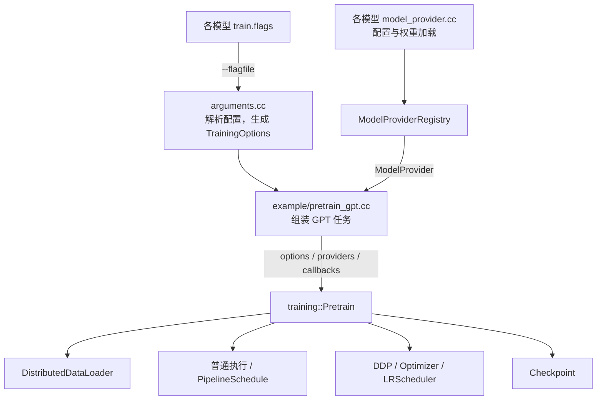

# 统一 GPT 预训练入口设计

统一训练入口将 GPT-2、LLaMA3、Qwen3 的训练过程组织为一套框架生命周期。任务入口负责提供模型、数据和计算逻辑，`infini_train::training::Pretrain()` 负责执行这些逻辑，并管理并行包装、优化器、学习率调度和训练状态。

三个模型都基于 `nn::TransformerModel`，架构由 `TransformerConfig` 描述。这一共同基础使模型特例可以通过 provider 接入统一训练流程。开发者增加模型时维护模型目录，增加训练能力时维护框架训练层。

本文以当前实现为准。结构调整的对照基线是 `master` 提交 `a70c996`（`test: align Qwen3 validation case configurations`）。

## 1. 架构与职责

设计分为任务、训练接口和执行机制三个层次：



任务层决定训练什么模型、使用什么数据、如何计算输出和损失。框架层把这些任务定义组合成可执行的训练过程。并行组件、优化器和 checkpoint 模块承担各自的执行职责。

| 组件 | 位置 | 职责 |
| --- | --- | --- |
| GPT 任务入口 | [example/pretrain_gpt.cc](../example/pretrain_gpt.cc) | 解析任务参数，选择模型 provider，构造数据、forward/loss 和采样回调，调用 `Pretrain()`。 |
| 训练接口 | [training.h](../infini_train/include/training/training.h) | 定义 `TrainingOptions`、provider、训练步骤类型与 `Pretrain()` 声明。 |
| 训练执行 | [training.cc](../infini_train/src/training/training.cc) | 初始化 rank，创建训练组件，调度训练并管理恢复与保存。 |
| 命令行适配 | [arguments.cc](../infini_train/src/training/arguments.cc)、[arguments.h](../infini_train/include/training/arguments.h) | 定义公共参数，校验参数文件，定位默认配置，将参数转换为 `TrainingOptions`。 |
| 模型注册表 | [model_provider_registry.h](../infini_train/include/training/model_provider_registry.h)、[实现](../infini_train/src/training/model_provider_registry.cc) | 管理模型名称到构建函数的映射，生成名称列表和诊断信息。 |
| 模型适配 | `example/<model>/` | 提供 `config.h`、`model_provider.cc`、`checkpoint_loader.cc` 和 `train.flags`。 |
| GPT 数据适配 | `example/common/` | 提供 token 数据读取、tokenizer 和 LLMC 文件格式辅助功能。 |

相对基线，原来分布在三个 `main.cc` 中的职责按下面的方式归集：

| 基线中的职责 | 当前归属 |
| --- | --- |
| 三个模型各自组织完整训练程序 | 一份 `pretrain_gpt.cc` 组装任务，一份 `Pretrain()` 执行训练。 |
| 入口内部选择模型配置与 loader | 各模型的 provider 向注册表登记构建逻辑。 |
| 入口中的模型训练默认值 | 各模型目录的 `train.flags`。 |
| 通用参数、优化器、调度器、数据位置和 checkpoint 管理 | 框架 `training/` 层。 |
| 普通路径与 PP 路径中的任务计算 | 统一的 forward/loss 回调协议。 |

## 2. 公共训练接口

公开接口位于 `infini_train::training`：

```cpp
void Pretrain(const TrainingOptions &options,
              const DatasetProvider &dataset_provider,
              const ModelProvider &model_provider,
              const ForwardStep &forward_step,
              const AfterStep &after_step = {});
```

`TrainingOptions` 描述一次训练运行的公共配置。Provider 和回调描述任务的可替换部分，框架负责它们的调用时机。当前接口以 `TransformerModel`、`TransformerConfig` 和定长语言模型 batch 为模型与数据约定。

| 接口 | 输入与返回值 | 执行契约 |
| --- | --- | --- |
| `ModelProvider` | 返回 `shared_ptr<nn::TransformerModel>` | 每个 rank 在并行上下文就绪后调用一次，创建该 rank 对应的 CPU 模型。设备迁移、LoRA 注入和并行包装由训练流程完成。 |
| `DatasetProvider` | 接收目标全局训练样本数，返回 `DatasetSplits{train, valid}` | 每个 rank 创建自己的数据集对象，由框架建立分布式加载器并维护迭代位置。 |
| `ForwardStep` | 接收模型或本地 chunk、输入、标签和实际模型配置，返回 `ForwardStepResult` | 定义一个 microbatch 的前向计算和损失计算方式。 |
| `AfterStep` | 接收包装后的模型、设备和已完成步数 | 在优化器与调度器更新后，由最后一个全局 rank 调用；适合日志、结果展示和单 rank 采样。 |

配置在启动工作线程前完成解析，训练期间按只读方式使用。模型和数据 provider 为各 rank 创建独立对象；回调捕获的共享状态应满足相应的并发访问约定。

### 2.1 训练步骤类型

普通训练和流水线执行共用 `training.h` 中的步骤协议：

```cpp
using TensorList = std::vector<std::shared_ptr<Tensor>>;
using LossFunction = std::function<std::shared_ptr<Tensor>(const TensorList &)>;

struct ForwardStepResult {
    TensorList output;
    LossFunction loss_func;
};
```

`output` 保存模型输出或中间激活，`loss_func` 定义如何从输出计算当前 microbatch 的平均损失。闭包可以捕获该 microbatch 的标签等数据，使输出与损失计算保持对应关系。

接口中的两个 forward 类型承担不同角色：

| 类型 | 使用位置 | 配置信息 |
| --- | --- | --- |
| `ForwardStep` | 任务入口传给 `Pretrain()` | 显式接收实际模型的 `TransformerConfig`。 |
| `ForwardStepFunction` | 普通训练循环与 PP 调度器 | 训练流程已绑定当前 rank 的模型配置，执行器直接传入模型、输入和标签。 |

这些类型统一归属 `infini_train::training`。`training.h` 使用标准库类型和前向声明表达接口；具体类的定义由实现文件显式包含。PP 通过这个轻量公共头文件使用训练步骤协议。

## 3. 模型接入与注册

模型注册表把命令行名称映射为构建函数。入口的模型选择过程是：

```cpp
const auto &models = training::ModelProviderRegistry::Instance();
const auto model_provider = models.Resolve(FLAGS_model, FLAGS_llmc_filepath);

training::Pretrain(options, dataset_provider, model_provider,
                   ForwardStepGPT, after_step);
```

`Resolve()` 查找名称、复制 factory 并绑定权重路径，返回一个零参数的 `ModelProvider`。模型实例在训练流程调用该 provider 时创建。这样，模型构建可以读取已经设置好的 TP/PP 状态，并生成当前 rank 的本地层和 VPP chunk。

各模型的实现集中在自己的目录：

| 模型 | Provider | 配置与加载策略 |
| --- | --- | --- |
| GPT-2 | [model_provider.cc](../example/gpt2/model_provider.cc) | 从尺寸表登记标准名称及 `d*` 别名；选择 LLMC 加载或指定尺寸的随机初始化。 |
| LLaMA3 | [model_provider.cc](../example/llama3/model_provider.cc) | 使用 LLaMA3 配置校验和 LLMC loader。 |
| Qwen3 | [model_provider.cc](../example/qwen3/model_provider.cc) | 使用 Qwen3 配置校验和 LLMC loader。 |

每个 provider 文件通过文件内的静态初始化 lambda 调用 `Register()`。登记发生在进入 `main()` 前，登记内容是名称和函数；模型构建属于后续的 rank 初始化流程。训练阶段使用已经解析、绑定的回调，注册表的修改阶段位于程序启动期。

注册表要求名称唯一、factory 为可调用对象。名称冲突和非法注册在登记时报告；`--help` 和未知模型错误中的可用名称列表都由同一张注册表生成。

CMake 将 provider 源文件直接编入 executable，使注册代码参与程序初始化。采用静态库封装 provider 时，链接规则需要显式保留这些注册对象。

### 3.1 实际模型配置

训练流程以已创建模型的配置作为结构信息来源：

```cpp
auto base_model = model_provider();
const auto model_config = base_model->Config();
```

这份配置用于序列长度校验、PP 接收 shape、chunk 数量、TP loss 的有效词表范围和 checkpoint 元数据。模型的配置、参数布局和训练组件据此采用一致的尺寸信息。

模型适配层负责完整填充配置：

- GPT-2 的 `n_kv_head` 与实际 `n_head` 相等，表达 MHA 结构。
- LLaMA3 和 Qwen3 的 `original_vocab_size` 取自 LLMC 文件中的实际词表大小。
- GPT-2 随机初始化先使用 `GPT2Config()`，再按尺寸表设置层数、head 数、KV-head 数和 hidden size，并按 TP 大小补齐词表。

GPT-2 的尺寸表位于 `example/gpt2/config.h`，包含 `gpt2/gpt2-medium/gpt2-large/gpt2-xl` 及对应的 `d12/d24/d36/d48` 别名。LLMC loader 根据文件头和权重布局构建实际模型，配置预设用于随机初始化路径。

## 4. 一次训练运行的生命周期

入口解析参数、取得 model provider，并组装 dataset、forward/loss、采样回调。随后由 `Pretrain()` 组织以下过程：

1. **建立运行环境。** 校验公共选项，初始化全局并行环境和精度检查环境，在当前进程按线程配置运行本地 rank。
2. **建立 rank 上下文。** 设置线程局部 rank、设备和 DP/TP/PP 通信组，计算梯度累积次数。
3. **构建模型。** 调用 provider，读取实际 `Config()`，执行设备迁移、精度检查名称映射和 LoRA 注入。
4. **包装并行执行。** 根据拓扑构建 `PipelineParallel` 和 DDP；组合使用时，先建立流水线，再为本地 chunk 添加 DDP 包装。
5. **建立数据与优化组件。** 调用 dataset provider，创建加载器，通过 `SetupOptimizer()` 和 `SetupLRScheduler()` 创建优化器及调度器。
6. **恢复训练状态。** 通过 `ResumeFromCheckpoint()` 恢复状态，并根据消费样本数推进数据迭代器。
7. **执行训练步。** 运行 forward/loss、梯度累积、backward 和优化器更新，随后更新学习率调度器。
8. **处理步后工作。** 汇总 loss、记录性能与内存指标，调用 `AfterStep`，按配置保存 checkpoint。

模型构建和并行包装有明确的先后关系：provider 使用 rank 上下文确定模型分片，设备迁移和 LoRA 注入准备待训练的参数集合，DDP/PP 包装建立执行与同步关系。`SetupOptimizer()` 最后从包装后的模型中选取普通参数或 LoRA 参数，并与 `NamedParameters()` 对齐。

### 4.1 Batch 与数据位置

`batch_size` 表示每个 microbatch 的序列数，`total_batch_size` 表示每次优化器更新的全局 token 数。设 DP 大小为 `D`、序列长度为 `S`、microbatch 大小为 `B`，梯度累积次数为：

```text
M = total_batch_size / (B * S * D)
```

配置要求 `M` 为正整数。普通执行每次读取一个 microbatch，累计 `M` 次；PP 执行每次读取 `B * M` 条序列，再由调度器拆分为 microbatch。

Dataset provider 接收的目标全局训练样本数为：

```text
num_iteration * total_batch_size / sequence_length
```

GPT provider 使用 `TinyShakespeareDataset` 读取有限的 token 文件，训练循环通过循环迭代达到目标步数。数据消费计数以全局样本数表示，因此不同执行路径可以使用同一套恢复位置逻辑。

### 4.2 精度与训练状态

前向计算和损失计算在 `AutocastGuard` 管理的精度环境中执行，backward 按训练流程设定的上下文运行。精度选择来自 `TrainingOptions::dtype`。

`llmc_filepath` 提供权重初始化来源，`load` 提供训练状态恢复来源。恢复前，model provider 先建立匹配的模型结构。Checkpoint 保存模型参数、按选项启用的 optimizer 状态、scheduler 状态、已完成步数和消费样本数，并记录模型尺寸与 DP/TP/SP/PP 元数据。

恢复训练时使用相同的模型结构、并行切分和调度配置。`num_iteration` 是包含已完成步数的目标总步数；`lr_decay_iters` 等参数定义整段训练的调度时间轴。

## 5. 普通执行与 PP 的共同计算协议

`ForwardStepGPT` 负责模型前向，并根据 TP 配置选择交叉熵损失。其返回的损失闭包捕获当前标签，执行器据此完成当前 microbatch 的训练。

普通路径的核心过程是：

```text
读取 microbatch，迁移到设备
    → forward_step(model, inputs, target)
    → result.loss_func(result.output)
    → loss / M
    → backward
```

完成 `M` 个 microbatch 后执行一次 optimizer step。DDP 的 `no_sync` 控制与梯度累积次数配合，最后一个 microbatch 触发相应同步。

### 5.1 流水线中的前向与损失

`PipelineParallel` 接收可选的 `training::ForwardStepFunction`，通过 `SetupSchedule()` 传给 `PipelineSchedule`。调度器按任务表执行每个本地 chunk：

| 执行位置 | 输入 | 标签 | 回调结果的用途 |
| --- | --- | --- | --- |
| 首个 chunk | token 张量 | 最终 chunk 才接收标签 | 输出作为后续 chunk 的激活。 |
| 中间 chunk | 通信接收的激活 | 空指针 | 输出继续参与流水线传输。 |
| 最终 chunk | 前序激活 | 当前 microbatch 的标签 | 保存模型输出和损失闭包，供对应反向任务使用。 |

调度器按 microbatch 索引保存最终损失闭包。在该 microbatch 的反向任务中，执行闭包、释放闭包引用、将损失除以 `M`，再调用 backward。输出和标签的生命周期由张量引用与闭包共同管理。

这份协议把任务计算和执行时序连接起来：任务负责模型输出与 microbatch 平均损失，训练执行器负责累积缩放、反向、梯度同步和参数更新。任务回调应遵守这一职责分配。

PP 接收 shape 由实际模型配置生成，采用 `[batch_size, sequence_length / SP, n_embd]`，其中 `SP` 为序列并行分片数。当前接收缓冲区使用 `float32`，跨阶段激活的形状与 dtype 应满足这一通信约定。

PP 使用现有的调度表生成、通信、microbatch 拆分和 `no_sync` 机制。`PipelineSchedule::Step()` 负责 zero-grad 和 optimizer step，外层训练循环负责 scheduler step。采用损失模块接口的调用方可以使用默认构造参数，经由 `ForwardOneChunk()` 和 `loss_fn` 执行。

## 6. 配置模型与命令行

配置由三层组成：框架默认值、模型运行预设、调用时覆盖。

### 6.1 默认值来源

`TrainingOptions` 定义框架公共选项及默认值。`arguments.cc` 的 `DEFINE_*` 从同一份默认配置读取初始值，使 C++ 直接调用与 CLI 启动使用一致的基础配置。

每个模型目录的 `train.flags` 表达该模型的运行预设：

| 配置 | [GPT-2](../example/gpt2/train.flags) | [LLaMA3](../example/llama3/train.flags) / [Qwen3](../example/qwen3/train.flags) |
| --- | --- | --- |
| optimizer | `sgd` | `adam` |
| learning_rate | `0.0001` | `0.00001` |
| lora_target_modules | `c_attn,c_proj` | `c_attn,c_proj,c_fc,c_fc2` |
| load_optimizer_state / save_optimizer_state | `false` | `true` |
| profile_name | `gpt2` | 对应模型名 |

预设还包含 batch、序列长度、精度和训练步数等参数。`--model` 的职责是选择注册的模型构建函数；优化器等训练设置由上述配置层共同确定。

### 6.2 参数文件与覆盖顺序

参数文件采用以下格式：

```text
# LLaMA3 training preset
--model=llama3
--optimizer=adam
--learning_rate=0.00001
```

每行一个 `--name=value`，布尔参数也支持 `--flag` / `--noflag`。空行和以 `#` 开头的注释行用于组织内容。多个文件可以通过 `--flagfile=a.flags,b.flags` 加载，文件包含关系通过直接的 `--flagfile=...` 表达。显式文件路径及嵌套文件中的相对路径按进程工作目录解释。

参数按顺序生效，后出现的同名参数覆盖前面的值：

```bash
./build/pretrain_gpt --flagfile=example/llama3/train.flags \
  --input_bin=/path/to/train.bin --llmc_filepath=/path/to/llama3.bin \
  --learning_rate=0.00002 --num_iteration=100
```

这个调用使用 LLaMA3 预设，并将学习率和目标步数设为命令行给出的值。直接以 CLI 表达配置也是等价的使用方式：

```bash
./build/pretrain_gpt --model=gpt2 --optimizer=sgd --learning_rate=0.0001 \
  --load_optimizer_state=false --save_optimizer_state=false \
  --input_bin=/path/to/train.bin --llmc_filepath=/path/to/gpt2.bin
```

通用入口要求通过 CLI 或参数文件提供模型名。其余公共选项按照框架默认值补齐；例如单独指定 `--model=gpt2` 时，optimizer 和 learning rate 的基础值仍是 `TrainingOptions` 中的 Adam、`1e-5`。加载 GPT-2 预设会将其设为 SGD、`1e-4`。

### 6.3 严格解析

`ParseTrainingFlags()` 将参数文件校验和 gflags 解析组织为同一启动步骤。文件内的参数名应已注册，非布尔参数应显式赋值，文件包含关系应可解析且无环。参数名错误或非布尔参数缺少赋值时，诊断包含文件和行号；文件读取和循环包含错误会指出相关路径。数值与布尔值的类型转换及其错误诊断由 gflags 完成。

gflags 执行 validator 时持有注册表锁，因此解析流程先采集参数类型快照，文件校验器再基于快照工作。文件校验器、路径定位和其他内部 helper 都位于 `arguments.cc` 的匿名 namespace 中。公共接口是 `ParseTrainingFlags()` 与 `TrainingOptionsFromFlags()`。

## 7. 构建产物与部署

训练能力由两个链接组件提供：

| 组件 | 内容 | 使用方式 |
| --- | --- | --- |
| `InfiniTrain::infini_train` | 公共训练接口及执行实现、模型注册表 | C++ 调用者构造 `TrainingOptions` 与回调，调用 `Pretrain()`。 |
| `InfiniTrain::training_cli` | 参数定义、文件校验、路径定位和配置转换 | 采用标准训练命令行的应用按需链接。 |

CLI 作为单独静态库，使训练参数的注册范围与应用的链接选择保持一致。框架 executable 链接接口使用 whole-archive 保留运行时注册对象；GPT 的 provider 源文件直接列入 executable 源码列表，参与启动期注册。

四个 executable 共用 `INFINITRAIN_GPT_EXAMPLE_SOURCES`：

| executable | 配置选择 |
| --- | --- |
| `pretrain_gpt` | CLI 显式提供模型与配置。 |
| `gpt2` | 先加载 `configs/gpt2/train.flags`，再解析 CLI。 |
| `llama3` | 先加载 `configs/llama3/train.flags`，再解析 CLI。 |
| `qwen3` | 先加载 `configs/qwen3/train.flags`，再解析 CLI。 |

CMake 通过 `INFINITRAIN_GPT_DEFAULT_FLAGFILE` 为三个兼容 executable 指定相对配置路径，并在构建时同步模型目录中的文件：

```text
build/
  pretrain_gpt
  gpt2
  llama3
  qwen3
  configs/
    gpt2/train.flags
    llama3/train.flags
    qwen3/train.flags
```

默认文件相对实际 executable 定位。部署时将程序与相邻的 `configs/` 一起分发，运行目录可以独立选择；Linux 通过 `/proc/self/exe` 定位，支持从 `PATH` 启动。

默认文件存在时，取值顺序为“默认文件 → 显式参数文件 → 后续 CLI”。默认文件缺失时，用户可通过显式 `--flagfile` 提供完整的运行配置；缺少配置来源时，入口会报告定位结果和处理建议。

编辑 `example/<model>/train.flags` 后，执行对应构建目标即可同步随包副本。直接编辑随包文件，或显式读取源码中的文件，更新会在下次启动时生效。

外部后端在入口解析参数前完成注册。后端通过设备抽象提供运行时操作，并可设置 `TrainingOptions::synchronize_device`，要求在模型上传后及训练资源释放前执行设备同步。

## 8. 开发与扩展

### 8.1 接入模型

新增同类 Transformer 模型时，围绕模型目录组织实现：

1. 在 `config.h` 中定义架构、尺寸及其校验规则。
2. 在 `checkpoint_loader.cc` 中实现权重格式映射，并填充实际模型配置。
3. 在 `model_provider.cc` 中登记名称和 factory；factory 根据权重路径选择加载或随机初始化。
4. 在 `train.flags` 中提供模型选择和训练预设。
5. 将 provider、loader 源文件加入 GPT executable 的 CMake 源码列表。

注册表随后为入口提供名称解析、帮助列表和诊断信息。GPT-2 的尺寸别名通过该模型自己的尺寸表统一登记。

### 8.2 扩展数据与任务计算

新的数据来源通过实现 `Dataset` 并提供 `DatasetProvider` 接入。数据层负责文件格式、样本构造和可用序列长度，模型配置提供上下文长度约束；训练参数应同时满足二者。

新的目标函数通过 `ForwardStep` 和损失闭包表达。回调返回当前 microbatch 的平均损失，执行器按梯度累积次数缩放并完成更新。需要跨 microbatch 加权的目标，应同时定义清晰的损失归一化契约。

`AfterStep` 的执行位置是最后一个全局 rank。单 rank 文本生成通过 `freq_generate_txt` 控制频率，零表示关闭。涉及 TP collective 的采样流程需要组织相应 rank 协同执行。`val_loss_every`、`sample_every` 和 `overfit_single_batch` 当前是预留选项，对应分支为占位逻辑；扩展这些能力时，可分别接入评估步骤、采样步骤和可恢复的 sampler。

### 8.3 扩展框架训练能力

| 需求 | 主要修改位置 |
| --- | --- |
| 新增公共训练参数 | `TrainingOptions` 定义字段及默认值，`arguments.cc` 提供 CLI 映射和转换。 |
| 新增优化器或调度策略 | `SetupOptimizer()`、`SetupLRScheduler()` 及对应实现模块。 |
| 新增训练状态 | checkpoint 的保存、恢复和数据消费位置处理。 |
| 调整流水线执行 | `nn/parallel/pp` 中的调度和通信实现，并验证训练回调与损失模块两条调用路径。 |
| 构建外部 GPT executable | 使用 GPT 任务源码、provider/loader、框架 executable 链接接口和 CLI 组件，并分发相应参数文件。 |

## 9. 与 Megatron 的语义对应

设计参考了 Megatron-LM `core_v0.12.0` 的 [pretrain_gpt.py](https://github.com/NVIDIA/Megatron-LM/blob/core_v0.12.0/pretrain_gpt.py)、[training.py](https://github.com/NVIDIA/Megatron-LM/blob/core_v0.12.0/megatron/training/training.py) 和 [pipeline schedules](https://github.com/NVIDIA/Megatron-LM/blob/core_v0.12.0/megatron/core/pipeline_parallel/schedules.py)，并核对了提交 [4e1df1b6](https://github.com/NVIDIA/Megatron-LM/blob/4e1df1b62ccb799269b131046362f1f948ad5308/megatron/training/training.py) 中的配置与 builder 路径。

两者共享的设计原则是由任务提供模型、数据及 forward/loss，由训练基础设施决定模型包装、状态管理和执行时序。

| 语义 | Megatron | InfiniTrain 中的映射 |
| --- | --- | --- |
| 模型供应 | model provider 根据阶段信息创建模型 | provider 在 rank 上下文中创建 `TransformerModel`，由模型自身组织本地层和 VPP chunk。 |
| 数据供应 | dataset provider 提供训练所需数据集 | `DatasetProvider` 返回 `DatasetSplits`，加载器和消费位置由训练流程管理。 |
| 任务计算 | forward step 返回输出和 loss 回调 | `ForwardStepResult` 表达输出与延迟损失，执行器完成归一化和反向。 |
| 执行调度 | 公共训练流程选择 forward/backward schedule | 普通循环和 `PipelineSchedule` 消费同一套任务步骤协议。 |

InfiniTrain 的 DataLoader 已负责组成 batch，PP 调度器负责拆分 microbatch，因此 forward 接口接收准备好的张量。模型阶段信息由已有并行上下文和 `TransformerModel` 管理。这些映射使 provider 语义与框架现有类型、线程模型和执行组件相衔接。

## 10. 验证方式

仓库中的自动化检查采用 C++ / GoogleTest，并通过 CTest 执行：

| 测试 | 关注点 |
| --- | --- |
| [test_model_provider_registry.cc](../tests/pretrain/test_model_provider_registry.cc) | 延迟构建、回调与绑定参数的生命周期、名称冲突及诊断信息。 |
| [test_training_arguments.cc](../tests/pretrain/test_training_arguments.cc) | 默认值一致性、参数覆盖顺序、文件语法、嵌套包含、路径处理和显式配置接入。 |

```bash
cmake --build build --target test_model_provider_registry test_training_arguments
ctest --test-dir build -R 'ModelProviderRegistryTest|TrainingArgumentsTest' --output-on-failure
```

训练行为验证使用固定模型权重和 token 数据，分别检查普通执行、并行执行和中断恢复。关键观察量包括 loss、参数更新、optimizer/scheduler 状态及消费样本数。中断恢复应在相同模型结构、拓扑和调度时间轴下，与连续训练进行对照。

已有本地记录覆盖 CPU-only/CUDA 构建、三模型数值对照、LoRA、断点恢复、两卡并行以及 LLaMA3 四卡组合。头文件检查验证了 `training.h` 的独立包含，运行检查还覆盖普通 CPU 训练和两卡 PP/VPP 冒烟检查。训练记录主要使用固定的小层数、小 hidden size 模型；GoogleTest 的持续覆盖范围如上表所列。

配置部署验证采用复制和移动 executable/configs 目录、切换工作目录、通过 `PATH` 启动等方式，并检查最终生效的配置。默认值和文件校验单测提供参数语义验证，实际 executable 检查提供构建产物与启动流程验证。
