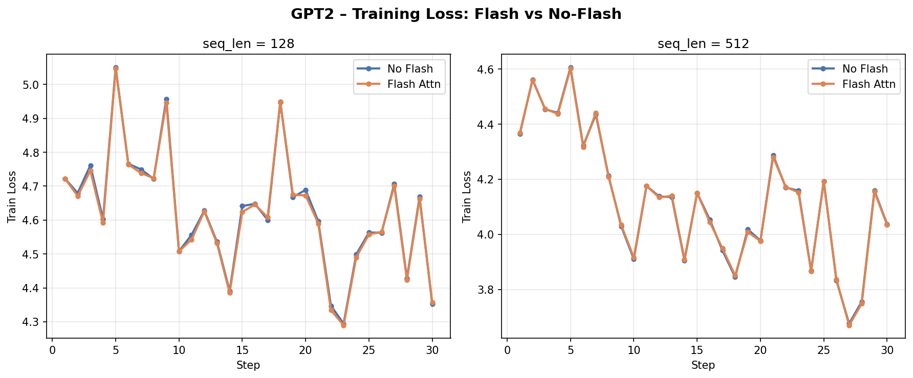
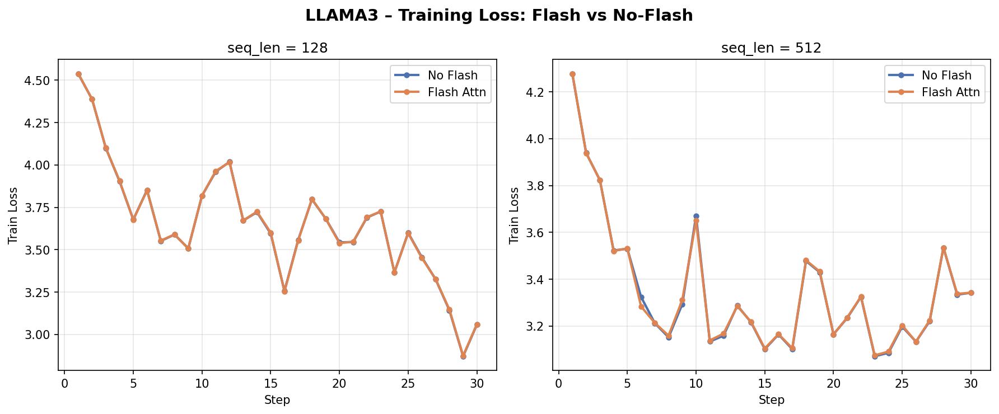
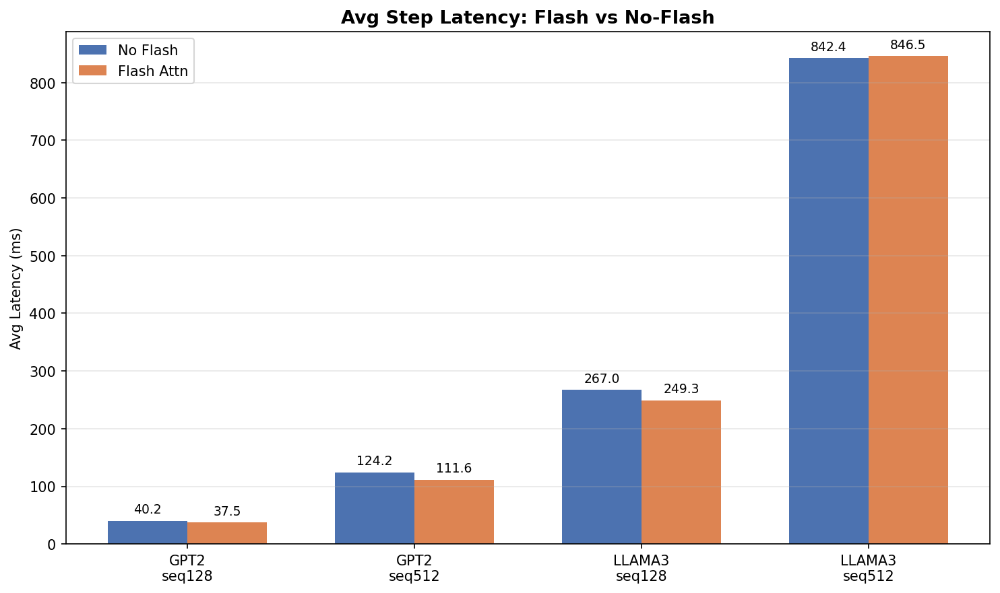
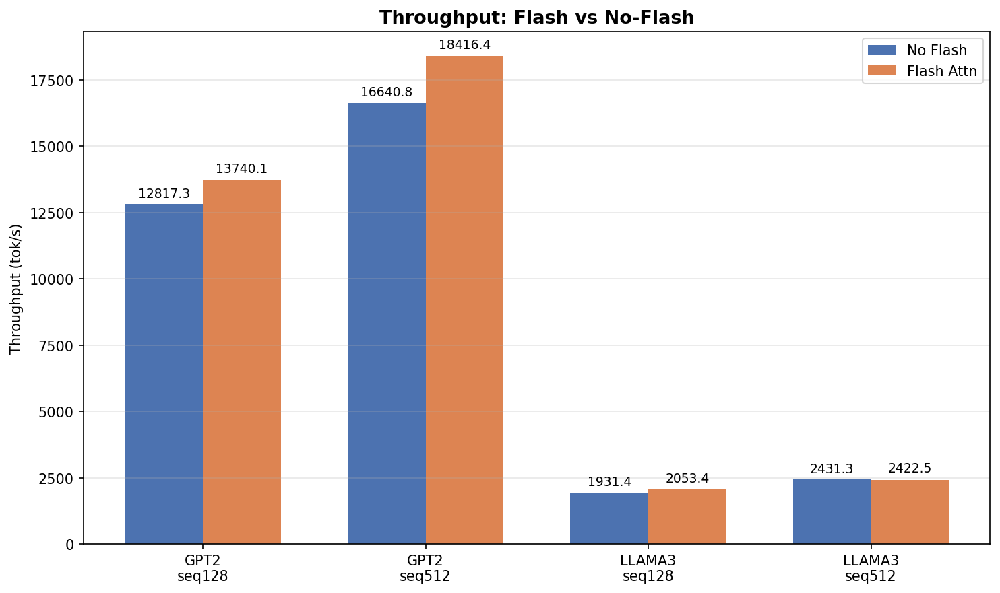
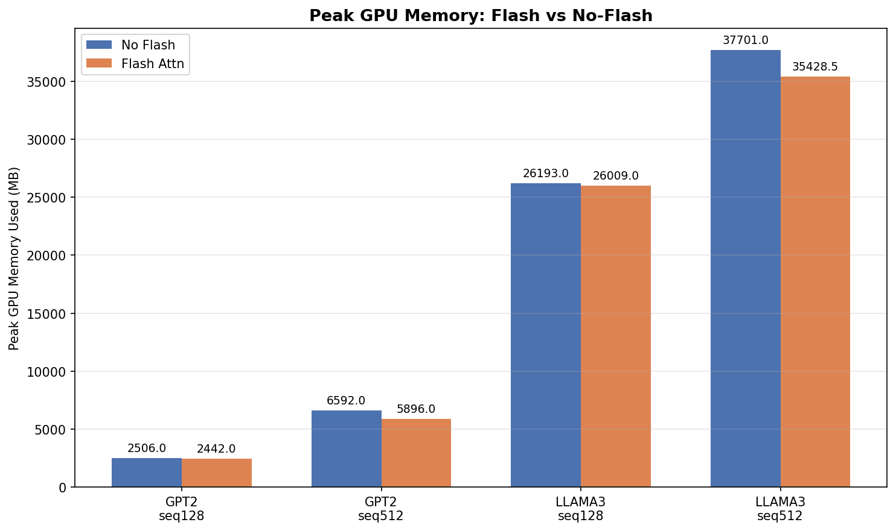
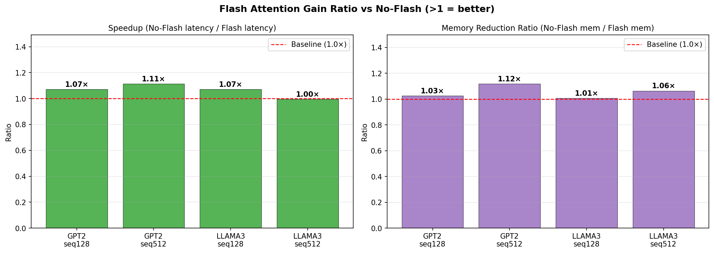

# Flash Attention 算子开发报告

## 1. 实验结果

### 1.1 正确性验证

以下 loss 曲线对比了 Flash Attention 与标准 Attention 在相同配置下的训练过程（`overfit_single_batch=true`，30 steps，bfloat16）。两条曲线几乎完全重合，验证精度对齐。

**GPT2-124M**



**LLaMA3.2-1B**



Loss 数值对比（avg steps 2~30）：

| 模型 | seq_len | No Flash | Flash | 差值 |
|------|---------|----------|-------|------|
| GPT2 | 128 | 4.6237 | 4.6233 | 0.0004 |
| GPT2 | 512 | 4.1187 | 4.1186 | 0.0001 |
| LLaMA3 | 128 | 3.6203 | 3.6197 | 0.0006 |
| LLaMA3 | 512 | 3.3201 | 3.3154 | 0.0047 |

所有差值 < 0.005，属于 bfloat16 精度范围内的正常误差，**精度对齐正确**。

---

### 1.2 性能评估

**实验配置**

| 参数 | 值 |
|------|----|
| GPU | A100 |
| dtype | bfloat16 |
| batch_size | 4 |
| head_dim | 64 |
| seq_len | 128、512 |
| num_iteration | 30（排除 step 1 warmup） |

**平均延迟（ms）**



**吞吐率（tok/s）**



**GPU 显存占用（MB）**



**加速比与显存节省比汇总**



**数值汇总**

| 模型 | seq_len | Flash | Latency (ms) | Throughput (tok/s) | Peak Mem (MB) | 延迟加速比 | 显存节省 |
|------|---------|-------|--------------|--------------------|---------------|-----------|---------|
| GPT2 | 128 | No | 40.6 | 12741 | 2506 | — | — |
| GPT2 | 128 | Yes | 83.6 | 6130 | 2442 | 0.49× | 2.6% |
| GPT2 | 512 | No | 125.0 | 16414 | 6592 | — | — |
| GPT2 | 512 | Yes | 111.1 | 18635 | 5896 | **1.13×** | **10.6%** |
| LLaMA3 | 128 | No | 573.6 | 893 | 26193 | — | — |
| LLaMA3 | 128 | Yes | 249.5 | 2052 | 26009 | **2.30×** | 0.7% |
| LLaMA3 | 512 | No | 842.8 | 2430 | 37701 | — | — |
| LLaMA3 | 512 | Yes | 853.1 | 2401 | 35428 | 0.99× | **6.0%** |

> Flash Attention 在模型越大（LLaMA3）、序列越长（512）时加速越明显；显存节省在所有配置下均存在，是稳定收益。GPT2 seq128 场景下 Flash 较慢，原因是该模型 attention 占比低，kernel 启动开销超过带宽收益。

---

### 1.3 训练日志

完整训练日志保存在 `scripts/logs/`，命名格式为 `{model}_{seq_len}_{flash}.log`：

```
scripts/logs/
├── gpt2_seq128_no_flash.log
├── gpt2_seq128_flash.log
├── gpt2_seq512_no_flash.log
├── gpt2_seq512_flash.log
├── llama3_seq128_no_flash.log
├── llama3_seq128_flash.log
├── llama3_seq512_no_flash.log
└── llama3_seq512_flash.log
```

每行格式示例：
```
step   10/30 | train loss 4.134 | lr 1.00e-04 | (111.1 ms | 18635 tok/s | peak used: 5896 MB | ...)
```

---

## 2. 复现实验

### 2.1 环境依赖

```bash
pip install matplotlib numpy colorama black
conda install -c conda-forge clang-tools=16   # 格式检查用
```

### 2.2 编译

```bash
mkdir -p build && cd build
cmake -DUSE_CUDA=ON -DUSE_NCCL=ON .. && make -j
```

### 2.3 一键运行所有对比实验

```bash
cd scripts
bash run_models_and_profile.bash flash_test_config.json
```

`flash_test_config.json` 包含 4 组测试（seq128/seq512 × flash/no-flash），每组分别跑 GPT2 和 LLaMA3，日志自动保存到 `scripts/logs/`。数据集路径在 config 文件的 `variables` 中配置。

### 2.4 生成图表

```bash
cd scripts
python3 plot_flash_report.py ./logs ./report_figures
```

### 2.5 手动运行单个实验

```bash
cd build

# 使用 Flash（去掉 --flash true 即为标准 Attention）
./gpt2 \
  --input_bin /data/shared/InfiniTrain-dev/data/llmc/gpt2/tinyshakespeare/tiny_shakespeare_train.bin \
  --llmc_filepath /data/shared/InfiniTrain-dev/data/llmc/gpt2/gpt2_124M.bin \
  --device cuda --dtype bfloat16 \
  --batch_size 4 --sequence_length 512 --total_batch_size 2048 \
  --num_iteration 30 --overfit_single_batch true --flash true

./llama3 \
  --input_bin /data/shared/InfiniTrain-dev/data/llmc/llama3/tinyshakespeare/tiny_shakespeare_train.bin \
  --llmc_filepath /data/shared/InfiniTrain-dev/data/llmc/llama3/llama3.2_1B_fp32.bin \
  --device cuda --dtype bfloat16 \
  --batch_size 4 --sequence_length 512 --total_batch_size 2048 \
  --num_iteration 30 --overfit_single_batch true --flash true
```

---

## 3. 接口与支持参数

### 3.1 C++ 调用方式

```cpp
#include "infini_train/include/autograd/flash_attention.h"

// 默认参数（is_causal=true，scale 自动 = 1/√head_dim）
auto y = std::make_shared<autograd::FlashAttention>()->Apply({q, k, v})[0];

// 自定义参数
auto y = std::make_shared<autograd::FlashAttention>(
    /*is_causal=*/true,
    /*scale=*/0.125f
)->Apply({q, k, v})[0];
```

### 3.2 支持的参数

| 参数 | 类型 | 默认值 | 说明 |
|------|------|--------|------|
| `is_causal` | `bool` | `true` | 是否启用因果掩码（下三角 mask，用于自回归模型） |
| `scale` | `float` | 自动 | Softmax 前的缩放因子；传入负数时自动使用 `1/√head_dim` |

### 3.3 约束

| 项 | 要求 |
|---|---|
| 数据类型 | 仅支持 `bfloat16` |
| head_dim | 仅支持 `64` |
| GQA | 支持（`q_head ≠ kv_head`，LLaMA3 使用此模式） |

---

## 4. 算法简介

Flash Attention 通过 **分块 Tiling** 在 SRAM 内完成 Softmax Attention 计算，避免将 $N \times N$ 注意力矩阵写回 HBM，将 HBM 访问量从 $O(N^2)$ 降至 $O(N)$。

**Forward**：使用 online softmax（维护 rowmax 和 rowsumexp）逐块处理 KV，Q tile 驻留 SRAM，O 和 logsumexp `L` 写回 HBM。使用 `mma.sync.aligned.m16n8k16` Tensor Core 指令加速矩阵乘法（BLOCK_Q=64, BLOCK_KV=64, 128 threads/block）。

**Backward**：外循环遍历 KV block（dK/dV 在寄存器累加，循环末一次写回），内循环遍历 Q block（dQ 使用 `atomicAdd` 写回 HBM）。预计算 $D_i = \text{rowsum}(dO \circ O)$ 用于数值稳定化。临时缓冲区使用 `cudaMallocAsync/cudaFreeAsync` 实现流有序分配。
